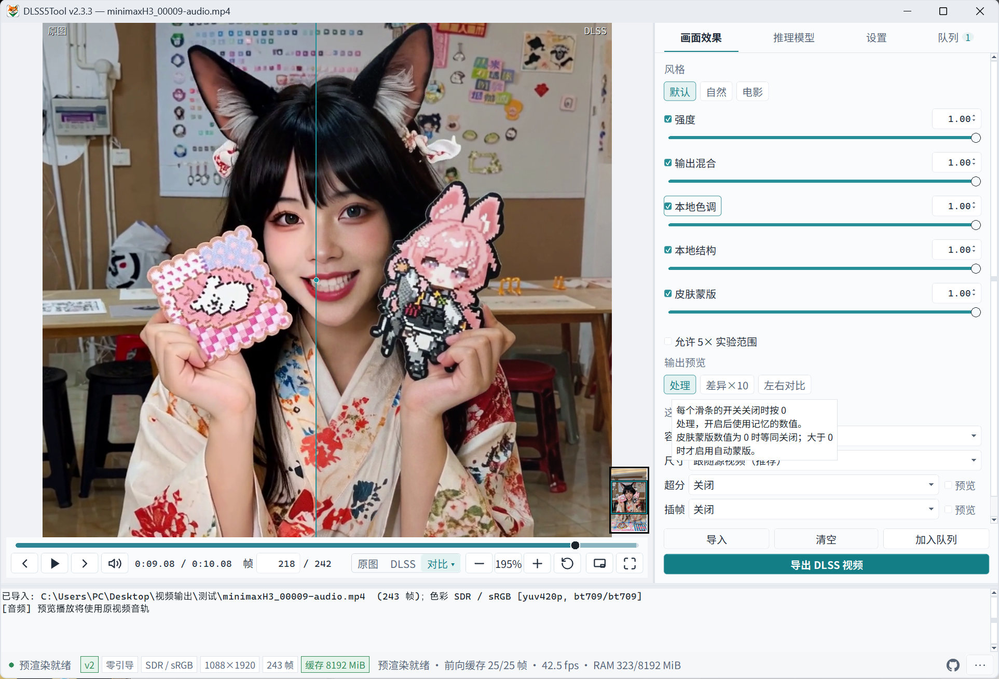
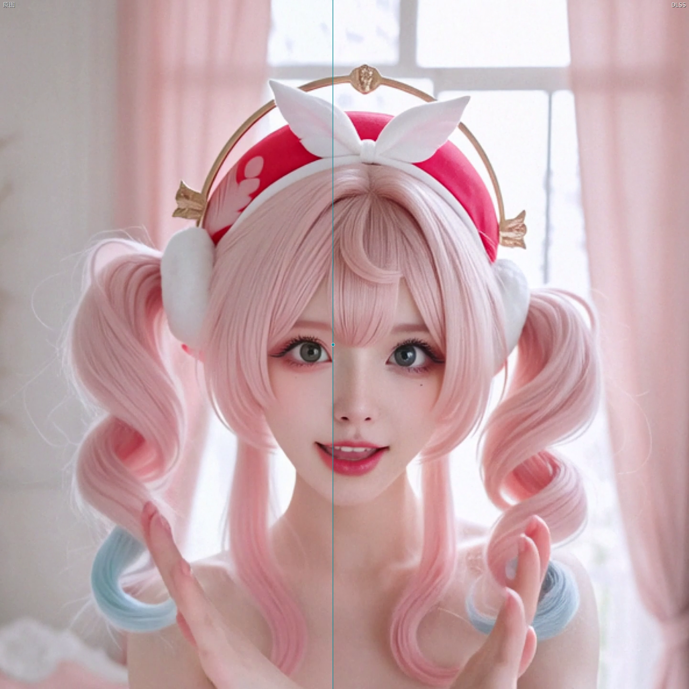
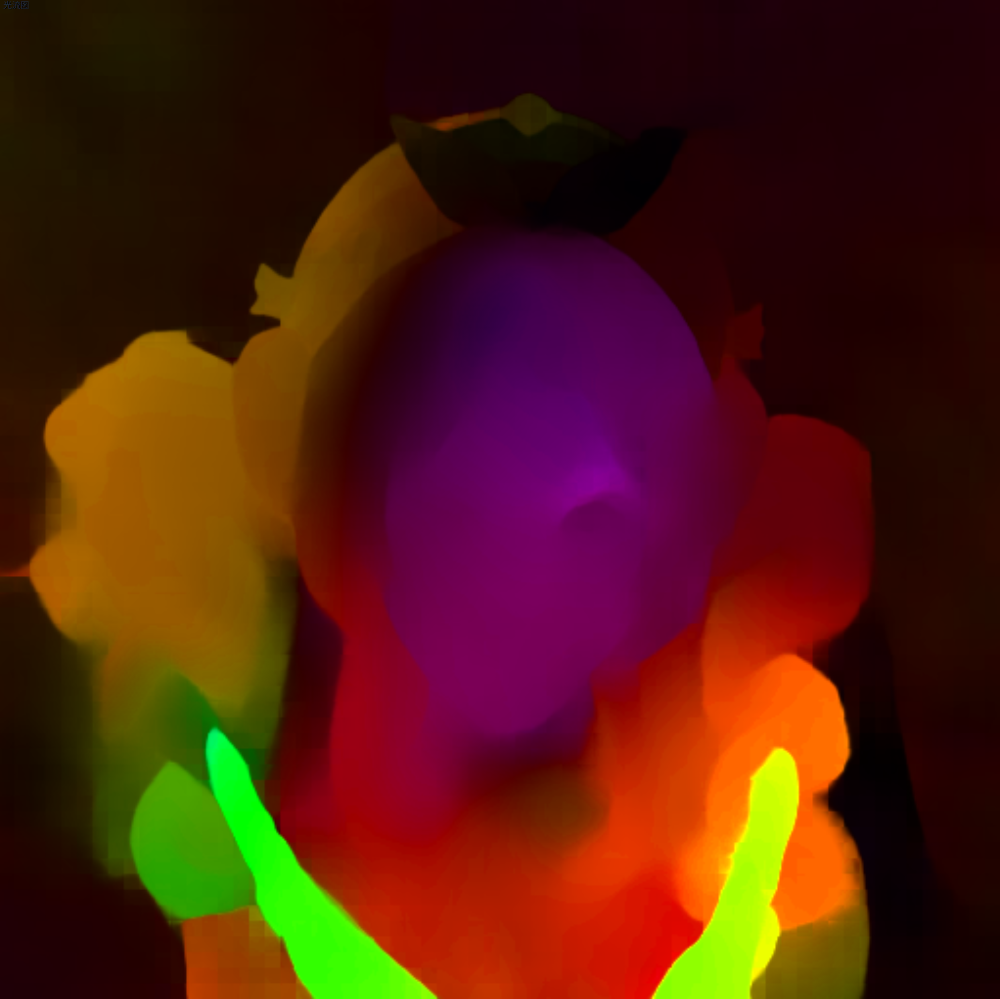
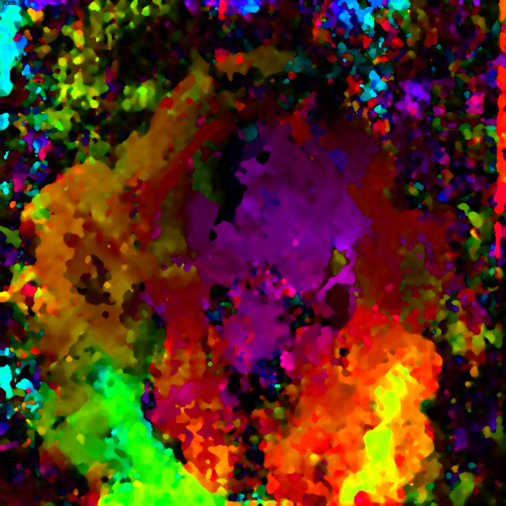

<h1 align="center">
  
</h1>

<p align="center">
  Reshape light and detail locally with DLSS 5, bringing a more lifelike look to videos and images.
</p>

<p align="center">
  <a href="README.md">简体中文</a> ·
  <strong>English</strong> ·
  <a href="https://github.com/banbanzhige/DLSS5Tool/releases/latest">Download portable release</a> ·
  <a href="#quick-start">Quick start</a> ·
  <a href="CHANGELOG.md">Changelog</a>
</p>

<p align="center">
  <a href="CHANGELOG.md"></a>
  <a href="#quick-start"></a>
  <a href="#2-select-the-runtime-for-your-gpu"></a>
  <a href="LICENSE"></a>
</p>

## In-app preview

<p align="center">
  <a href="img/03.png"></a>
</p>

<p align="center"><sub>Application screenshot from v2.1.1</sub></p>

## Before and after

The images below use the same AI-generated source. The left side is untouched and the right side is the neural-rendered result. This illustrates changes to materials, lighting, and detail; results vary by source.

<table>
  <tr>
    <th width="50%">Image 1 · Original</th>
    <th width="50%">Image 2 · After neural rendering</th>
  </tr>
  <tr>
    <td align="center"><a href="img/01.png"></a></td>
    <td align="center"><a href="img/02.png"></a></td>
  </tr>
</table>

## RAFT / NVOFA optical flow comparison

Flow maps visualize inter-frame motion, not the final rendered image: **hue encodes direction and brightness encodes displacement magnitude**. They are neither segmentation maps nor quality scores. Click an image to view it at full size.

<table>
  <tr>
    <th width="33%">07 · Original / DLSS wipe</th>
    <th width="33%">08 · RAFT flow</th>
    <th width="33%">09 · NVOFA flow</th>
  </tr>
  <tr>
    <td align="center"><a href="img/07.png"></a></td>
    <td align="center"><a href="img/08.png"></a></td>
    <td align="center"><a href="img/09.png"></a></td>
  </tr>
</table>

In these examples, RAFT produces more coherent large motion regions and subject outlines. NVOFA shows more fragmented colors around the background, hair, and face. This observation does not establish final DLSS image quality. The screenshots lack complete frame-pair and parameter metadata, so they are illustrative only; the measurements below use separately controlled inputs and settings.

### Measured with the current configuration

2026-09-10, RTX 4070 SUPER 12 GB / driver 616.64. Analysis long edge: 512; RAFT-Large: 6 updates / FP32; NVOFA: SLOW / **1×1 grid** / temporal hints off (the saved test configuration, subsequently adopted as the default). Identical DLSS v2 settings, source-resolution SDR, cache off, fallback forbidden. Each backend ran three times per clip with alternating order; values below are medians.

| Clip | RAFT total time (effective fps) | NVOFA total time (effective fps) | NVOFA time reduction |
| --- | ---: | ---: | ---: |
| Square 1440×1440 · 165 frames | 17.08 s (9.66) | 10.54 s (15.65) | 38.3% |
| Portrait 1088×1920 · 243 frames | 20.77 s (11.70) | 14.23 s (17.08) | 31.5% |

Total time includes decoding, first-frame worker loading, flow, DLSS, per-frame hashing, and H.264 NVENC encoding. It excludes preflight/encoder checks, host construction, and audio handling: **it is neither GUI click-to-file latency nor real-time playback fps**. Steady flow-stage times, including input preparation, readback, and resizing but excluding DLSS, were **31.21 / 6.19 ms** (RAFT / NVOFA) for square and **23.21 / 5.29 ms** for portrait. Flow-stage speedup is not whole-export speedup.

| Quality proxy ↓ (39 pairs per clip; 8-bit RGB levels) | Square RAFT | Square NVOFA | Portrait RAFT | Portrait NVOFA |
| --- | ---: | ---: | ---: | ---: |
| Flow warp MAE · shared valid region | 3.099 | 2.592 | 3.469 | 3.652 |
| DLSS enhancement temporal residual · fixed RAFT reference | 1.560 | 1.610 | 1.446 | 1.478 |
| DLSS enhancement temporal residual · fixed NVOFA reference | 1.516 | 1.424 | 1.394 | 1.391 |

**NVOFA was faster on both local clips, but there was no universal quality winner.** Its warp error was lower on square and higher on portrait; temporal-residual rankings changed with the reference flow. These unencoded-data proxies are neither ground-truth flow errors nor perceptual quality scores. No continuous-playback blind review was performed, so equal quality, flicker-free output, and ghost-free motion are not established. RAFT-Large remains the default.

See the [full methodology, run-to-run variation, no-flow baseline, and reproduction commands (Chinese)](docs/experiments/README_FLOW_BENCHMARK.md) and [public measurements with component hashes](docs/experiments/README_FLOW_BENCHMARK_20260910.json).

## Features

DLSS5Tool uses **DLSS 5 Neural Rendering** to enhance local videos and images. No game engine integration is needed. It is a post-processing tool for existing media, not a game plugin or frame-interpolation tool.

- **Image enhancement:** Default, Natural, and Cinema styles with strength, tone, structure, and skin-mask controls.
- **2× / 4× super resolution:** Upscale with RTX Video before enhancement, or process at the original size.
- **Interactive comparison:** Draggable wipe, side-by-side views, zoom, frame stepping, fullscreen, and a detachable preview.
- **Batch export:** Mix images and videos in one queue, with independent settings per item. Export MP4 / MKV / MOV video and preserve compatible source audio.
- **HDR video:** High-precision HDR10 / HLG processing and 10-bit export; see the HDR limitations below.
- **Optical flow guidance (optional):** Estimate inter-frame motion for temporal guidance. Results depend on the source.

The interface supports Simplified Chinese / English and light / dark themes. Change the language under **More → Language**, then restart the app.

The current source version is **v2.1.2; release packages have not been uploaded**: the flow backend can be RAFT or NVOFA, with RAFT-Large the default. Launch with `run.bat` at the repo root. Download links below refer to published releases, not necessarily this version.

## Quick start

You need **Windows 10 / 11 x64, a compatible NVIDIA RTX GPU and driver**, and the [Microsoft Visual C++ Redistributable x64](https://learn.microsoft.com/cpp/windows/latest-supported-vc-redist). See step 2 for GPU-specific runtimes.

### 1. Download and fully extract the package

Get the [portable release](https://github.com/banbanzhige/DLSS5Tool/releases/latest), not GitHub's automatically generated `Source code` archives.

| Your needs | Package |
| --- | --- |
| Enhancement and 2× / 4× super resolution | **Lite (recommended)**: `DLSS5Tool-vVERSION-win64.zip` |
| Optical flow as well | **Full**: all volumes starting with `DLSS5Tool-vVERSION-win64-full.zip.001` |
| Add model features to an existing lite installation | **Inference add-on**: all volumes starting with `DLSS5Tool-vVERSION-win64-addon.zip.001` |

- Full already includes the add-on. Download every volume of the same version into one folder, then open `.001` in 7-Zip to extract.
- Close the app before extracting the add-on beside `DLSS5Tool.exe`; do not create `mods/mods`.
- **Fully extract into a writable folder before running.** Keep `DLSS5Tool.exe` beside `_internal`. No separate Python or FFmpeg installation is required.

### 2. Select the runtime for your GPU

| GPU | Setup |
| --- | --- |
| RTX 40 series | Use the bundled default runtime |
| RTX 30 series | Download `30系.zip` from the same release and place the DLL as shown below |
| RTX 50 series | Download `50系.zip` from the same release and place the DLL as shown below |

For RTX 30 / 50 series, close the app and place the matching `nvngx_dlssnr.dll` in the `mods` folder beside the executable:

```text
mods\nvngx_dlssnr.dll
```

Do not overwrite `_internal`. If you previously selected a custom DLL path, check that setting too. The RTX 30-series runtime is a community adaptation, not an NVIDIA support commitment; compatibility depends on the GPU and driver combination.

### 3. Import, compare, and export

1. Open `DLSS5Tool.exe`, then drop in an image or video, or click **Choose a file**.
2. Switch to **DLSS** or **Compare**, then choose a style and adjust strength in **Effects**. Press `3` for split comparison.
3. Choose the output format and quality in **Settings**. Enable 2× / 4× super resolution if you want to upscale.
4. Export the current item, or add items to the queue for batch processing.

Start with the default settings and a short clip or single image. See the [user guide](docs/USER_GUIDE.en.md) for detailed controls.

## Before you start

- **Results and speed vary by source and hardware.** Interactive comparison does not mean real-time model processing. High resolutions, 4× scaling, and optical flow increase processing time and VRAM use.
- **Optical flow is optional.** With Full or the add-on installed, select a mode under **Models**. The app remembers your selection and restores it after a startup environment check; a failed check turns it off and reports the reason. First use checks RAFT-Large before enabling it; a saved off mode remains off. Guidance currently supports only SDR, non-tiled processing; a single image has no inter-frame flow.
- **HDR metadata is not fully preserved.** Preview is tone-mapped to SDR. Export retains basic HDR10 / HLG color tags, but not Dolby Vision / HDR10+ dynamic metadata or some source HDR metadata. Static HDR images are not supported. See [output and quality](docs/USER_GUIDE.en.md#output-and-quality).

## FAQ

**The app will not start, or a DLL is missing.**

Fully extract the package, keep the EXE beside `_internal`, and install the x64 Visual C++ runtime. Do not mix application files from different versions.

If you are running a `Source code` package, installing Python dependencies does not provide the native DLLs. Follow [Build and run from source](#build-and-run-from-source) below. `missing dlssnr_host.dll` can also mean the v2 host was not found and the app tried the legacy host; it does not necessarily mean you need the legacy DLL.

**Preview is slow, or high-multiplier super resolution fails.**

Lower playback quality, try smaller media or 2× scaling, and temporarily disable optional optical flow. A larger cache cannot speed up frames that have not yet been processed.

**How do I update?**

Use **More → Check for updates**, or download the latest Release. In-app downloads contain the lite edition. Close the old app, extract the new version into a new folder, and configure the runtime for your GPU. For model features, use the matching Full edition or add-on.

**Still having trouble?**

Use **More → Diagnostics**, then open an [issue](https://github.com/banbanzhige/DLSS5Tool/issues) with the app version, GPU, driver, reproduction steps, and diagnostic log. Check logs for local paths and other private information before posting.

## Build and run from source

These steps apply to the **current source layout**. For ordinary use, choose the portable release. GitHub's `Source code` archives do not include compiled DLLs or NVIDIA SDKs. `setup.bat` **only installs Python dependencies; it does not compile hosts or install NVIDIA runtimes**. The UI may open while media processing remains unavailable until those components are ready.

### 1. Prepare the build environment

- Windows 10 / 11 x64, Python 3.10+ with Tkinter and the `py` launcher, and Git.
- Visual Studio 2022 Build Tools with the **Desktop development with C++** workload and Windows SDK. The Visual C++ redistributable alone cannot compile the hosts.
- Actual processing requires a compatible NVIDIA GPU, driver, and an authorized NVIDIA runtime matching your GPU.

Run the commands below from the source root. Continue only after each step succeeds.

### 2. Install Python dependencies and compile the DLSS host

```powershell
.\setup.bat
git clone --depth 1 https://github.com/NVIDIA/DLSS.git third_party/NVIDIA-DLSS
# After reviewing and accepting the SDK license:
.\native\host_v2\build.bat
```

Skip cloning if the SDK is already present. A successful build creates `runtime\dlssnr_host_v2.dll`. Automatic host selection prefers v2; you do not need to find the legacy `dlssnr_host.dll` or rename the v2 DLL to that name.

### 3. Provide the DLSS runtime

Place an authorized `nvngx_dlssnr.dll` matching your GPU in the `runtime` folder under the source root. If you already have the same-version portable package, you can extract an applicable runtime from its `_internal` folder. For RTX 30 / 50 series, select the appropriate attachment as described in [GPU runtime selection](#2-select-the-runtime-for-your-gpu).

`dlssnr_host_v2.dll` is the host built from this project; `nvngx_dlssnr.dll` is a separately supplied NVIDIA runtime. Compiling the host does not produce the latter. If you have a replacement in `mods` or a custom runtime path, confirm the selected file under **Runtime & model paths**.

### 4. Optional: build 2× / 4× super resolution components

For super resolution, obtain RTX Video SDK 1.1, review and accept its license, and extract it to `third_party\RTX_Video_SDK`, or set `NV_RTX_VIDEO_SDK` to the SDK root. Then run:

```powershell
.\native\vsr_host\build.bat
```

The script creates `runtime\vsr_host.dll` and copies `nvngx_vsr.dll` from the SDK into `runtime`. Skip this step if you do not need super resolution.

### 5. Check the files and launch

```text
Source root/
├── run.bat
├── gui.py
└── runtime/
    ├── dlssnr_host_v2.dll
    ├── nvngx_dlssnr.dll
    ├── vsr_host.dll          # Super resolution only
    └── nvngx_vsr.dll         # Super resolution only
```

```powershell
.\run.bat
```

Use `run.bat` as the source-development entry point; it prefers `.venv`. Settings, queues, and development logs are stored in `var`. These steps cover base enhancement and optional super resolution. Model inference components require a [separate build](mods/README.md#维护者深度与构建). See the [developer guide](docs/development/BUILDING.en.md) for tests and portable EXE packaging.

**Older layout:** v2.1.1 uses `native_host_v2\build.bat` and `native_vsr_host\build.bat`, with DLLs in the source root. The current version uses `native\host_v2`, `native\vsr_host`, and `runtime`. Follow the instructions for your version; do not mix layouts or host binaries.

## Documentation

- [User guide](docs/USER_GUIDE.en.md): shortcuts, model settings, export details, and troubleshooting
- [Changelog](CHANGELOG.md)
- [Developer guide](docs/development/BUILDING.en.md) · [Contributing](CONTRIBUTING.md) · [Technical documentation index (Chinese)](docs/README.md)
- [Security reports](SECURITY.md)

## License

Project-owned source code is released under the [MIT License](LICENSE). `nvngx_dlssnr.dll`, NVIDIA SDKs, FFmpeg, and bundled Python dependencies remain subject to their respective upstream licenses and are not covered by this repository's MIT license. Candidate full/add-on packages include RAFT weights. See [THIRD_PARTY_NOTICES.md](THIRD_PARTY_NOTICES.md) and `mods/enhancement/licenses` in those packages.
