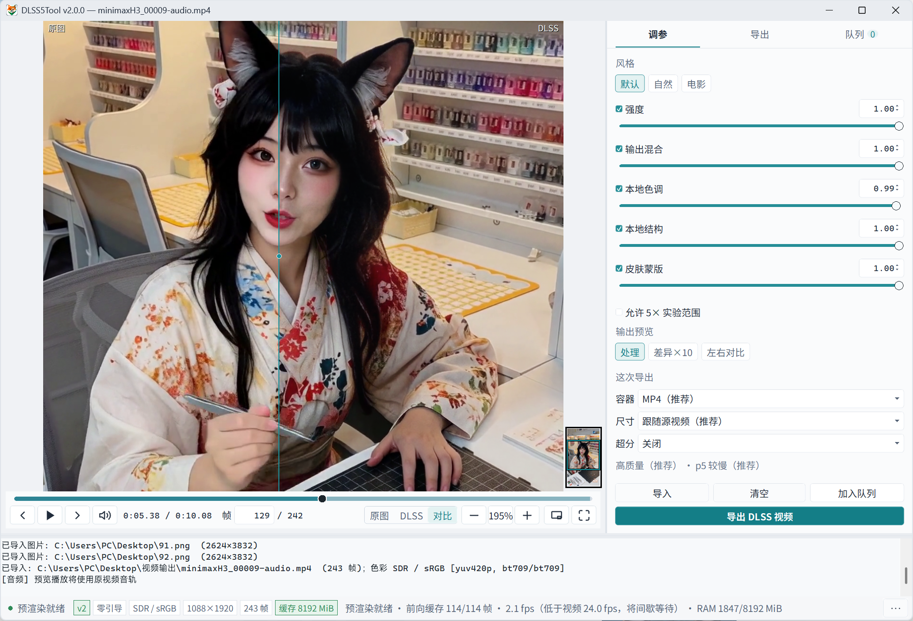

# DLSS5Tool

当前版本：**v1.1.2**

[查看完整更新日志](CHANGELOG.md)

给任意视频或图片做 **DLSS 5 Neural Rendering** 的本地小工具：导入即实时预览，调参即时生效，再按同样参数导出。

游戏里的 Feature 18 通常要引擎提供完整 G-Buffer。本工具走 **零引导、仅颜色** 路径，因此不依赖材质、法线、运动矢量或深度，就能把神经渲染当成后处理接到成片上——补真实感、压掉生成图常见的 AI 感与油腻感，同时比重渲或再跑一遍生成模型快得多。

## 实机演示

<p align="center">
  <a href="img/3.png"></a>
</p>

<p align="center"><sub>视频实时预览：左侧原图，右侧神经渲染结果；点击查看完整界面。</sub></p>

## 效果对比

下面两张图使用同一张 AI 生成素材：图 1 是未经处理的原图，图 2 是本工具的神经渲染结果。不同素材、运行时版本和参数可能产生不同效果；点击图片可查看 1000 × 1000 原图。

<table>
  <tr>
    <th width="50%">图 1 · 原图</th>
    <th width="50%">图 2 · 神经渲染后</th>
  </tr>
  <tr>
    <td align="center">
      <a href="img/01.png"></a>
    </td>
    <td align="center">
      <a href="img/02.png"></a>
    </td>
  </tr>
</table>

## 能做什么

- **任意视频或图片都能处理**：支持 MP4 / AVI / MOV / MKV / M4V / WebM，以及 PNG、JPEG、WebP、BMP、TIFF 等常见格式。无需游戏环境或 G-Buffer，导入成片即可使用 DLSS 5 Neural Rendering 进行同分辨率处理。
- **提升真实渲染质感**：利用 Feature 18 改善画面的材质观感、光影层次与结构细节，减轻生成内容常见的塑料感、过度磨皮和油腻高光，让视频或图片更接近自然、真实的渲染效果。
- **风格与融合程度可控**：可以选择渲染风格，并分别调整强度、本地色调、本地结构和输出混合，自由控制神经渲染对原画面的介入程度，以及颜色、纹理与原始内容的融合效果。
- **可选 500% 实验增强**：默认把全部强度滑条限制在安全的 `0%–100%`；开启「允许 5× 实验范围」后扩展到 `0%–500%`，超过 100% 可进一步推动模型参数，输出混合超过 100% 时会直接放大神经处理残差。
- **针对人物皮肤单独优化**：自动皮肤蒙版可将皮肤区域与衣物、头发和背景区分开，再通过「皮肤结构」单独增强人物皮肤的纹理与真实感，尽量减少对原有衣物色调和其它区域的影响。
- **实时预览与直观对比**：原图、处理后和可拖动分界线对比随参数即时更新，方便在导出前确认风格、色彩、结构与融合效果。
- **时间成本**：GPU 上一帧神经后处理即可，不必回到引擎重渲，也不必再排队跑一遍扩散/放大模型。
- **HDR 视频保真处理**：自动识别 HDR10/PQ 与 HLG，使用 RGBA16F 进入 Feature 18，按传递函数在线性光中混合，再写出带原色彩标签的 HEVC Main 10；界面预览单独做 SDR tone-map。
- **导出**：SDR 可用严格时序单会话或带预热帧的并行分段，优先 H.264 NVENC；HDR 固定严格单会话，优先 HEVC Main10 NVENC，并分别回退 `libx264` / `libx265`。
- **无需 PyTorch**：隔离的 D3D12 / NGX 宿主进程完成推理，Python 侧只负责解码、预览和写出。

## 工作原理：关掉游戏合同，只吃颜色

游戏内的 DLSS 5 Neural Rendering（NGX **Feature 18**）按完整渲染合同工作，评估时会去读材质、矢量、深度等引导。本工具固定：

| 策略 | 行为 |
| --- | --- |
| `guidance_mode = 0` | 引导关闭。神经渲染忽略光流与深度。 |
| `DLSSNR.Upscaling = 0` | 同分辨率后处理，不是 DLSS 超分辨率。 |
| 零引导快路径 | 整段会话复用一张全零 `DLSSNR.MVec` 和一张全零 `DLSSNR.Depth`，不再每帧上传。 |

创建 / 评估时 **不绑定** 下列 NGX 参数（游戏路径里它们才是必选项；这里故意留空，让运行时在无 G-Buffer 时仍能评估）：

**材质 / G-Buffer**

- `Albedo`
- `GBuffer.Albedo` / `GBuffer.DiffuseAlbedo` / `GBuffer.SpecularAlbedo` / `GBuffer.IndirectAlbedo`
- `GBuffer.Normals` / `GBuffer.Roughness`
- `GBuffer.Metallic` / `GBuffer.Specular` / `GBuffer.Subsurface`
- `GBuffer.MaterialId` / `GBuffer.ShadingModelId`
- `GBuffer.DisocclusionMask`
- `NormalRoughness` / `DLSSD.NormalRoughness`
- `DiffuseAlbedo` / `SpecularAlbedo` / `SpecularHitDistance`

**矢量**

- `MotionVectors`（本工具只提交全零的 `DLSSNR.MVec`）
- `GBuffer.SpecularMvec` / `SpecularMotionVectors`
- `MotionVectors3D` / `MotionVectorsReflection`

**深度与其它游戏侧辅助**

- `Depth` / `DepthHighRes`（本工具只提交全零的 `DLSSNR.Depth`）
- `Jitter.Offset.X` / `Jitter.Offset.Y`
- `ExposureTexture` / `TransparencyMask` / `AnimatedTextureMask` / `IsParticleMask`
- `RayTracingHitDistance`

同分辨率下 `preset`、`ui_correction`、`depth_convention` 也不参与结果。真正会改画面的是风格、强度、本地色调、本地结构、自动皮肤蒙版与皮肤结构。

因此：任意解码出来的 RGB 帧都能进 Feature 18，输出仍是同尺寸的神经增强帧。这不是通用 DLSS 超分集成，也不是光线重建；它是把游戏神经渲染接到离线成片上的实验路径。

### HDR10 / HLG 路径

v1.1.0 对带 `smpte2084`（PQ）或 `arib-std-b67`（HLG）传递特性的影片启用独立高精度链路：

1. FFmpeg 按源视频的范围、BT.2020 原色和传递特性解码为归一化 RGBA16F；不会先压成 8-bit。
2. v2 宿主把输入、输出资源创建为 `DXGI_FORMAT_R16G16B16A16_FLOAT`，创建 Feature 18 时设置 `NVSDK_NGX_DLSS_Feature_Flags_IsHDR`，并显式提交预曝光参数。
3. 输出混合在 PQ/HLG 解码后的线性光中进行，再编码回原传递曲线。
4. 写出 HEVC Main 10 / 10-bit 4:2:0，并保留 BT.2020、PQ/HLG 与 limited-range 标签；NVENC 不可用时回退 `libx265`。

HDR 导出固定使用独立的 v2 严格单会话，避免分段边界和旧宿主回退破坏格式合同。普通显示器中的预览只是 SDR tone-map，不代表最终 HDR 亮度。当前保留的是基础 HDR10/HLG 色彩标记，不承诺复制 Dolby Vision、HDR10+ 动态元数据或源文件的 mastering-display / MaxCLL SEI。

## 功能一览

- 拖放导入常见视频与图片；图片可按同一套参数处理并直接导出。
- `1` / `2` / `3` 切换原图、DLSS、对比；对比视图可拖动分界线，双击复位到 50%，按住 `Alt` 看纯原图。
- 输出端提供「处理」「差异×10」「左右对比」三种视图，并支持原图与 DLSS 结果连续混合。
- 4K 级素材默认以 1080p 代理尺寸实时处理；暂停、逐帧或拖动松手后恢复原始分辨率精确预览。
- 视频暂停、拖动或跳转后，会在「拖动后生成」设定的延迟结束时自动从当前帧向后预渲染，无需先按播放。
- 预览质量、拖动后生成延迟和 RAM 缓存预算均可调；时间轴标出已渲染与已解码排队区间，状态栏显示处理速度和内存占用。
- DLSS/对比播放采用严格同帧：当前帧未完成时暂停音视频并显示渲染蒙版，缓冲连续约 1 秒后恢复，不用原图或旧 DLSS 帧冒充结果。
- 支持原视频音轨预览；导出完成后自动保留可用的原音轨。
- 自动检测 HDR10/PQ 与 HLG 视频；高精度模式使用 RGBA16F Feature 18 和 HEVC Main10，HDR 预览单独映射为 SDR。
- 视频导出可跟随源尺寸，或限制到 2160p / 1440p / 1080p / 720p / 自定义上限；始终保持宽高比且不会放大低分辨率素材。
- 编码可选择极高质量、高质量、均衡、小体积四档恒定质量，或输入 0.5–500 Mbps 目标码率并查看预计文件大小。
- 新增「导出队列」Tab：可多选视频、递归添加文件夹或拖入多个视频，按加入时的处理与编码参数快照串行导出。
- 队列支持独立输出目录、自动避让重名、排序、失败/取消重试、当前项后暂停和取消当前项；重启程序后会恢复未完成任务。
- 导出显示实时帧率、已用时间和预计剩余时间；支持中途取消并尝试清理未完成文件。
- 隔离 NGX 工作进程；v2 / 旧版宿主可热切换，支持零引导快路径、持久缓冲、合并提交和 1–3 帧在途，失败自动回滚。
- 严格时序单会话导出，或为 SDR 使用带预热帧的并行分段导出；优先使用 NVIDIA NVENC，SDR/HDR 分别回退 `libx264`/`libx265`。
- 设置校验、原子写入、损坏后自动恢复。

## 路线图

- [ ] **ComfyUI 节点**：把当前宿主封装成节点，方便接到现有图生视频 / 图生图工作流里，预览与导出共用同一套 Feature 18 参数。

## 当前状态与限制

- 仅 Windows 10/11 与兼容的 NVIDIA GPU；建议使用仍受支持的最新驱动。
- 只有严格单会话模式能保证完整连续的 DLSS 时间历史；并行分段即使预热，也可能在边界处有细微差异。
- HDR 高精度导出仅支持带 PQ/HLG 标签的视频，不用于静态图片；缺失色彩标签的素材按 SDR 处理。
- HDR 预览和关闭高精度后的兼容导出会 tone-map 到 SDR；只有启用高精度的 HDR 视频导出保留 10-bit HDR 信号。
- 视频解码和颜色转换仍依赖 FFmpeg / OpenCV，整体速度不只取决于 GPU。HDR 路径需要带 `zscale` 和 HEVC 编码器的 FFmpeg 构建。
- 输出分辨率在 Neural Rendering 后缩小，因此可以降低文件尺寸，但不会减少 DLSS 处理耗时；当前不提供放大输出，以免与真正的 DLSS 超分混淆。
- 目标码率使用单遍 VBR；并行分段模式下各段独立控制，所以最终平均码率和预计文件大小属于近似值。
- 仓库刻意不包含 NVIDIA SDK、`nvngx_dlssnr.dll`、编译后的宿主 DLL、用户设置、日志或测试媒体。

## DLL 选择（2026-09-04 实测）

本次没有用上游文件覆盖 RTX 40 默认核心。RTX 4070 SUPER、1080p、100 帧多轮测试中，本仓库核心（SHA-256 `CEB6432F…6662650`）约 `82.97 fps`，Visual Enhancer 的 `310.8.SF-v2`（`6EB209E7…0B3927`）约 `83.00 fps`，RHI 的 `310.8.0-RTX40`（`4B8D19BC…2BA05`）约 `80.18 fps`；三者逐帧输出哈希完全一致。因此 SF-v2 没有可见画质收益，RHI 版本还略慢，保留本仓库 RTX 40 DLL 更稳妥。

RTX 30 发行包已从来源不明的 `310.8.0.0` 修改版（SHA-256 `38CFB4A4…A5C004`）换成 RHI 发布的 `310.8.SF-v2`（文件版本 `310.8.SF.0`，SHA-256 `6EB209E7…0B3927`）。旧文件虽列出 `sm_86`，但不是当前社区为 Ampere 验证的 FP16 构建；SF-v2 包含 `sm_75/86/89/120`，也是 DLSS5oneclick、DLSS5-Autopilot 和现有 RTX 30 集成所选择的版本。

截至该次检查，`nvngx_dlssnr.dll` 仍没有 310.8 之后的 RTX 50 新版。2026-09-03 出现的 `310.9.0` 是 `nvngx_dlss.dll`、`nvngx_dlssd.dll` 和 `nvngx_dlssg.dll`（超分、光线重建、帧生成），不是本工具使用的 Neural Rendering 核心。正式 RTX 50 DLSSNR 仍为 NVIDIA 签名的 `310.8.0.0`（SHA-256 `E16BCF15…E1FC8E`），只包含 `sm_120`。

Magpie v0.6.1 自带的社区 DLL（SHA-256 `984BEE0F…F81014`）实际只列出 `sm_89/120`，其发布说明也只标注 RTX 40/50，不能作为 RTX 30 包。用户所说的“Magpie 30 系 DLL”更可能是配合 Magpie 另行下载的 SF-v2；若文件哈希为 `6EB209E7…0B3927`，就是本项目现已采用的同一版本。

## 系统要求

- Windows 10/11 x64。
- Python 3.10 或更高版本。
- NVIDIA GPU 与兼容驱动。
- Microsoft Visual C++ 2015–2022 Redistributable（运行宿主所需）。
- Visual Studio 2022 Build Tools 与「使用 C++ 的桌面开发」工作负载（仅重新编译宿主时需要）。
- 从合法来源取得并有权使用的 NVIDIA DLSS Neural Rendering 运行时。

## 快速开始

### 免安装版（推荐普通用户）

下载 `DLSS5Tool-v1.1.2-win64.zip` 并完整解压，然后双击
`DLSS5Tool.exe`。免安装版已包含 Python 依赖和基础 FFmpeg，无需另装 Python；仍需
Windows 10/11 x64、兼容的 NVIDIA GPU/驱动和 Microsoft Visual C++ 2015–2022
Redistributable。不要只把 EXE 单独移出解压目录，旁边的 `_internal` 目录是运行所必需的。

免安装版默认附带的是面向 **RTX 40 系** 的 `nvngx_dlssnr.dll`。RTX 30 系或 RTX 50 系
用户请从同一版本的 Release 下载对应的 `30系.zip` 或 `50系.zip`，关闭程序后解压，并用
其中的 `nvngx_dlssnr.dll` 覆盖免安装版中的：

```text
_internal\nvngx_dlssnr.dll
```

- `30系.zip`：`310.8.SF-v2` FP16 兼容核心，SHA-256 `6EB209E764F39872625DEBD6ABAF45E2BB6322F6F270F781F70C059AE30B3927`。
- `50系.zip`：NVIDIA 签名 `310.8.0.0`，SHA-256 `E16BCF15E16E13F527491CDF7845B2FE6521A738D8F7C9C721866A8496E1FC8E`。

替换时只覆盖这个 DLL，不要删除、移动 `_internal` 中的其它文件。上述路径只适用于
免安装版；从源码运行时，`nvngx_dlssnr.dll` 应放在项目根目录。

开发者可以在项目根目录运行 `./build_release.ps1` 重建同一版本。构建脚本会创建 `.venv`、
安装依赖、运行测试，并在 `dist` 下生成免安装目录和 ZIP。

### 1. 安装 Python 依赖

双击 `setup.bat`。脚本会在项目目录创建 `.venv`，并安装 `requirements.txt`：

```powershell
py -3 -m venv .venv
.\.venv\Scripts\python.exe -m pip install -r requirements.txt
```

### 2. 准备原生依赖

从 NVIDIA 的官方仓库克隆 SDK。阅读并接受其许可证后，将它放在构建脚本预期的位置：

```powershell
git clone --depth 1 https://github.com/NVIDIA/DLSS.git third_party/NVIDIA-DLSS
```

然后编译 v2 宿主：

```powershell
.\native_host_v2\build.bat
```

构建成功后，项目根目录应有 `dlssnr_host_v2.dll`。再将你有权使用的
`nvngx_dlssnr.dll` 放到项目根目录。可选的旧版 `dlssnr_host.dll` 只用于兼容回退，
不属于源码发行版。

### 3. 启动

双击 `run.bat`，或运行：

```powershell
.\.venv\Scripts\python.exe gui.py
```

如果 FFmpeg 不在 `PATH` 中，打包内的 `imageio-ffmpeg` 会提供包含 `zscale`、NVENC 和
`libx265` 的回退版本；也可通过 `FFMPEG_EXE` 指向自己的完整 FFmpeg。程序会优先使用同目录
或 `PATH` 中的 `ffprobe` 检测 HDR 元数据，没有 `ffprobe` 时从 FFmpeg 输入信息安全降级检测。

## 基本操作

- 点击「导入」或将视频/图片拖入窗口。
- 使用 `1` / `2` / `3` 切换原图、DLSS、对比视图。
- 对比视图可单击定位或横向拖动分界线，双击分界线复位至 50%，按住 `Alt` 临时查看纯原图。
- `Space` 播放/暂停，方向键或滚轮逐帧，`Shift` + 方向键跳 1 秒。
- `F11` 或双击画面切换全屏，`Esc` 退出全屏。
- 「预览性能」可选择自动、1080p、1440p 或原始分辨率播放质量；此设置不影响导出质量。
- 预览缓存按系统 RAM 预算管理，并在暂停时尽量向后填满预算；约 1 秒只作为播放启动阈值，不再限制后台预渲染总量。时间轴上方浅青色表示已渲染区间，灰青色表示已解码并排队的区间。
- 当所选处理分辨率的 DLSS 吞吐低于视频帧率时，严格同步播放会间歇等待；状态栏会显示缓冲帧数、处理速度和 RAM 用量。
- 导出时可在「严格时序」和「视觉无损（并行分段）」之间选择。
- 「输出分辨率」只改变视频写出尺寸并保持宽高比；选择低于源视频的尺寸不会降低 DLSS 的源分辨率处理精度。
- 「码率控制」推荐使用按画质模式；需要控制文件体积时切换到目标码率，界面会按片长显示预计大小。
- 「编码速度」越慢通常压缩效率越高，但它不等同于编码质量或目标码率。
- 导入 PQ/HLG 视频后，「HDR10 / HLG 高精度处理」默认开启并锁定严格时序；关闭它会明确降级为 tone-mapped SDR 导出。
- 在「预览与调参」Tab 点击「加入队列」，可把当前视频和当前参数快照加入批量任务；之后继续调参不会改变已排队任务。
- 在「导出队列」Tab 可多选添加视频或递归添加文件夹。输出目录留空时写到各源文件旁边，已有同名文件会自动使用编号后缀。
- 队列逐个处理视频，单个 SDR 视频仍可使用其自身的并行分段模式；HDR 任务会自动使用严格单会话模式。

## 开发与测试

安装依赖后运行：

```powershell
.\.venv\Scripts\python.exe -m compileall -q -x third_party .
.\.venv\Scripts\python.exe -m unittest discover -v
```

单元测试使用模拟宿主，不需要 NVIDIA GPU 或专有 DLL。硬件探针位于 `scripts/`，只应在
已正确安装运行时的兼容机器上手动执行。

HDR 硬件链路可用一段已正确标记的 PQ/HLG 视频验证：

```powershell
.\.venv\Scripts\python.exe scripts\hdr_probe.py --input .\input-hdr.mp4 --output .\probe-hdr.mp4 --frames 12
```

## 目录结构

| 路径 | 用途 |
| --- | --- |
| `gui.py` | Tk GUI、预览与交互 |
| `app_settings.py` | 设置校验和原子持久化 |
| `export_queue.py` | 批量导出任务模型、状态恢复与原子持久化 |
| `dlss_engine.py` | 原生宿主的 `ctypes` 封装 |
| `dlss_host_process.py` | 隔离进程、共享内存与热切换 |
| `video_export.py` | FFmpeg 色彩检测、HDR/SDR 解码与 NVENC/x26x 写出 |
| `parallel_export*.py` | 分段并行导出 |
| `preview_audio.py` | 本地音频预览 |
| `native_host_v2/` | D3D12/NGX v2 宿主源码与构建脚本 |
| `scripts/` | 需要真实硬件的诊断探针 |
| `tests/` | 不依赖 GPU 的单元测试 |
| `third_party/` | 本地 SDK/参考仓库；不会提交 |

## 第三方组件与许可证

本项目定位为研究与实验工具，项目自有源码按 [MIT License](LICENSE) 发布。免安装版默认
使用的 `nvngx_dlssnr.dll` 由社区项目提供，30 / 40 / 50 系替换版本继续受其各自上游许可
约束，不属于本仓库 MIT 许可证的授权范围。MIT 许可证同样不覆盖 NVIDIA SDK、FFmpeg、
Python 依赖或参考项目；详情见 [THIRD_PARTY_NOTICES.md](THIRD_PARTY_NOTICES.md)。
