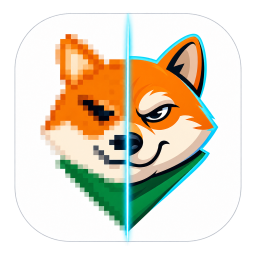

<p align="center">
  
</p>

# DLSS5Tool

当前版本：**v2.0.0**

[查看完整更新日志](CHANGELOG.md)

Windows 上开箱即用的本地小工具：把任意视频或图片丢进去，用 **DLSS 5 Neural Rendering** 提升真实渲染质量，也可以先做 2× / 4× 超分再增强。不需要游戏引擎，不用另装 Python 或其它依赖。

导入就能实时预览、边看边调；满意后按同样参数导出，或丢进队列批量处理。支持 RTX 30 / 40 / 50 系，HDR10 / HLG 视频走高精度路径。默认可以跟着源的分辨率、容器和图片格式走，也可以自己指定尺寸、画质或码率。

它不需要游戏里的材质、法线或深度，只吃画面颜色：把成片当后处理来跑，补材质和光影、压掉生成图常见的塑料感和油光，比重渲或再跑一遍生成模型快得多。

## 实机演示

<p align="center">
  <a href="img/3.png"></a>
</p>

<p align="center"><sub>左侧预览，右侧调参 / 导出 / 队列。v2.0.0 起为工作台布局，支持浅色和暗色皮肤。</sub></p>

## 效果对比

同一张 AI 生成素材：左图未处理，右图为神经渲染结果。不同素材、运行时和参数效果会有差别；点击可看 1000 × 1000 原图。

<table>
  <tr>
    <th width="50%">图 1 · 原图</th>
    <th width="50%">图 2 · 神经渲染后</th>
  </tr>
  <tr>
    <td align="center">
      <a href="img/01.png"></a>
    </td>
    <td align="center">
      <a href="img/02.png"></a>
    </td>
  </tr>
</table>

## 能做什么

- **任意视频或图片**：MP4 / MOV / MKV / AVI / WebM，以及 PNG、JPEG、WebP、BMP、TIFF。拖进窗口或点「选择文件」即可。
- **提升真实渲染质量**：同分辨率神经后处理，改善材质、光影和结构细节。风格（默认 / 自然 / 电影）、强度、本地色调、本地结构、输出混合、皮肤蒙版都可以调；需要更猛时再打开「允许 5× 实验范围」。
- **可选 2× / 4× 超分**：关掉就是原尺寸增强；打开后固定先 RTX Video 超分，再在目标分辨率上跑 DLSS 5。暂停或逐帧时预览走同一条链路。
- **实时预览与对比**：`1` / `2` / `3` 切换原图、DLSS、分界对比，拖动分界线立刻能看出差别。画布滚轮缩放、拖动平移、导航小窗；预览可分离到独立窗口，方便双屏调参。
- **HDR10 / HLG**：自动识别，高精度导出 10-bit HEVC 并保留原色彩标签。界面预览会映射成 SDR，不代表最终 HDR 亮度。
- **跟随源或自定义输出**：图片默认保持原格式、原尺寸（PNG / TIFF 按无损写出）。视频可跟随源分辨率和容器（MP4 / MKV / MOV），也可改成 2160p / 1440p / 1080p / 720p / 自定义上限，并在「极高质量」到「小体积」、或自定义码率之间选择。原音轨能直通的会直通。
- **队列批量**：图片和视频混排，支持多选、文件夹和拖放。每条任务记下加入时的参数，之后再调不影响已排队的项。重启后未完成任务会恢复。
- **RTX 30 / 40 / 50 系**：免安装包默认带 40 系运行库；30 / 50 系换对应 DLL 即可。超大静图会分区处理，输出仍是原像素尺寸。
- **开箱即用**：解压即跑，推理在独立进程里，不依赖 PyTorch。底栏可以检查更新、一键诊断、切换浅色 / 暗色皮肤。

## 下载

下载 [最新免安装包](https://github.com/banbanzhige/DLSS5Tool/releases/latest)（`DLSS5Tool-v2.0.0-win64.zip`）并**完整解压**，双击 `DLSS5Tool.exe`。不要只把 exe 单独拎走，旁边的 `_internal` 目录是运行所必需的。

需要：

- Windows 10 / 11 x64
- 兼容的 NVIDIA 显卡和驱动（RTX 30 / 40 / 50 系）
- [Microsoft Visual C++ 2015–2022 Redistributable](https://learn.microsoft.com/cpp/windows/latest-supported-vc-redist)

免安装版已带 Python 依赖和 FFmpeg，不用再装运行环境。启动后会在后台查一次正式版更新，也可在底栏「更多」里手动检查；只有发现新版本才提示，下载前会再确认一次。

### RTX 30 / 50 系运行库

默认 DLL 面向 **RTX 40 系**。30 系或 50 系请从同一版本的 Release 下载 `30系.zip` 或 `50系.zip`，关闭程序后用其中的 `nvngx_dlssnr.dll` 覆盖：

```text
_internal\nvngx_dlssnr.dll
```

- `30系.zip`：`310.8.SF-v2`，SHA-256 `6EB209E764F39872625DEBD6ABAF45E2BB6322F6F270F781F70C059AE30B3927`
- `50系.zip`：NVIDIA 签名 `310.8.0.0`，SHA-256 `E16BCF15E16E13F527491CDF7845B2FE6521A738D8F7C9C721866A8496E1FC8E`

只替换这一个文件。从源码运行时，把 DLL 放到项目根目录。

## 怎么用

- 把视频或图片拖到左侧投放区，或点「选择文件」。
- `1` / `2` / `3` 切换原图、DLSS、对比；对比视图可拖分界线，双击回到 50%，按住 `Alt` 看纯原图。
- 画布滚轮缩放，放大后拖动画布；`0` 适应窗口，`+` / `-` 调倍率。时间轴滚轮仍是逐帧。
- `Space` 播放 / 暂停，方向键逐帧，`Shift` + 方向键跳 1 秒；`F11` 或双击画面全屏。
- 播放条上的「分离」把画面和控件拆到独立窗口；关掉该窗口或点「停靠」会回来。
- 右侧 **调参** 改效果，**导出** 改容器、分辨率、超分、画质 / 码率和 HDR，**队列** 做批量。
- 当前素材可连同当时参数「加入队列」。队列支持重试、清理已完成、上移 / 下移；暂停或取消后可以从未完成项继续。
- 遇到初始化或显卡问题时，不必先导入素材：底栏「更多 → 一键诊断」，把导出的 `.log` 发给维护者即可。

更细的设置说明、默认参数和版本变化见 [CHANGELOG.md](CHANGELOG.md)。

## 注意

- 只在 Windows + NVIDIA 上工作。这不是游戏里的 DLSS 超分，默认是同分辨率神经后处理；2× / 4× 是可选的 RTX Video 超分，和后面的 DLSS 5 是两步。
- 只有「严格时序」能保证完整连续的时间历史；「视觉无损（并行分段）」更快，切片边界可能有细差。
- HDR 高精度只用于带 PQ / HLG 标签的视频，不用于静图；关掉高精度会 tone-map 成 SDR 再导出。
- 普通「输出分辨率」是在神经渲染之后缩小，不会先降低处理精度。打开超分后按源尺寸的 2× / 4× 输出。
- 视频「极高质量」仍是有损压缩，只是尽量少压处理结果，不是数学无损。图片按原格式写出，PNG / TIFF 才是无损。
- 仓库不包含 NVIDIA SDK、运行库 DLL、用户设置或测试媒体。


## 从源码运行

普通使用请走上面的免安装包。要改代码或自己编宿主时：

```powershell
# 1. 依赖
.\setup.bat

# 2. NVIDIA DLSS SDK（阅读并接受其许可证）
git clone --depth 1 https://github.com/NVIDIA/DLSS.git third_party/NVIDIA-DLSS
.\native_host_v2\build.bat

# 3. 把有权使用的 nvngx_dlssnr.dll 放到项目根目录后启动
.\run.bat
```

可选超分还需 RTX Video SDK 1.1，解压到 `third_party/RTX_Video_SDK` 或设置 `NV_RTX_VIDEO_SDK`，然后运行 `.\native_vsr_host\build.bat`。单元测试不需要 GPU：

```powershell
.\.venv\Scripts\python.exe -m unittest discover -v
```

开发约定见 [CONTRIBUTING.md](CONTRIBUTING.md)。重建免安装包：`.\build_release.ps1`。

## 许可证

项目自有源码按 [MIT License](LICENSE) 发布。免安装版附带的 `nvngx_dlssnr.dll`、NVIDIA SDK、FFmpeg 和 Python 依赖仍受各自上游许可约束，不属于本仓库 MIT 授权范围。详见 [THIRD_PARTY_NOTICES.md](THIRD_PARTY_NOTICES.md)。
