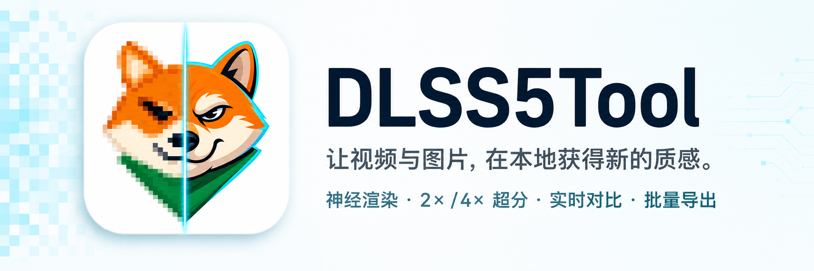

<h1 align="center">
  
</h1>

<p align="center">
  本地视频与图片增强，支持实时对比与批量导出。
</p>

<p align="center">
  <strong>简体中文</strong> ·
  <a href="README.en.md">English</a> ·
  <a href="https://github.com/banbanzhige/DLSS5Tool/releases/latest">下载免安装版</a> ·
  <a href="#快速开始">快速开始</a> ·
  <a href="CHANGELOG.md">更新日志</a>
</p>

<p align="center">
  <a href="CHANGELOG.md"></a>
  <a href="#快速开始"></a>
  <a href="#2-选择显卡运行库"></a>
  <a href="LICENSE"></a>
</p>

<details>
<summary>文档目录</summary>

- [实机演示](#实机演示) / [效果对比](#效果对比)
- [功能概览](#功能概览)
- [快速开始](#快速开始)
- [操作与快捷键](#操作与快捷键)
- [输出与画质说明](#输出与画质说明)
- [常见问题](#常见问题)
- [从源码运行](#从源码运行)
- [许可证](#许可证)

</details>

## 实机演示

<p align="center">
  <a href="img/3.png"></a>
</p>

<p align="center"><sub>上图为 v2.0.0 实机截图</sub></p>

## 效果对比

同一张 AI 生成素材：左图未处理，右图为神经渲染结果。可用于观察材质、光影和细节的变化，不代表所有素材都能获得相同改善；点击图片查看原尺寸。

<table>
  <tr>
    <th width="50%">图 1 · 原图</th>
    <th width="50%">图 2 · 神经渲染后</th>
  </tr>
  <tr>
    <td align="center">
      <a href="img/01.png"></a>
    </td>
    <td align="center">
      <a href="img/02.png"></a>
    </td>
  </tr>
</table>

## 功能概览

使用 **DLSS 5 Neural Rendering** 增强已有画面，可选先做 2× / 4× RTX Video 超分。推理在本机运行，无需接入游戏引擎或提供材质、法线、深度数据。免安装包自带 Python 依赖和 FFmpeg；v2.0.0 带来工作台布局、浅色 / 暗色皮肤与全新应用图标。

> 这是面向现有媒体的神经后处理工具，不是游戏中的 DLSS 超分或帧生成。效果与速度取决于素材、参数、显卡和运行库；RTX 30 / 50 系需要替换对应运行库，详见[快速开始](#快速开始)。

- **画面增强**：同分辨率神经后处理，提供默认 / 自然 / 电影风格，以及强度、本地色调、本地结构、输出混合和皮肤蒙版控制。
- **可选超分**：支持 2× / 4× RTX Video 超分，固定按「超分 → DLSS 5 增强」顺序处理；关闭时保持原尺寸增强。
- **交互预览**：原图 / DLSS / 分界对比，25%–800% 缩放、平移、导航小窗、逐帧与全屏；预览可分离到独立窗口，便于双屏使用。
- **HDR 视频**：自动识别 HDR10/PQ 与 HLG，高精度路径导出 HEVC Main10，并保留基础色彩标签。
- **灵活导出**：视频支持 MP4 / MKV / MOV、分辨率上限、画质档位和自定义码率；兼容的原音轨优先直通。
- **混合批量队列**：图片与视频混排，支持多选、文件夹递归扫描和拖放；每项保存独立参数快照，支持重试、排序及重启恢复。
- **桌面工作台**：浅色 / 暗色皮肤、可调整宽度的侧栏、运行日志、一键诊断和更新检查。推理使用独立进程，不依赖 PyTorch。

支持导入的视频扩展名：`MP4 / M4V / MOV / MKV / AVI / WebM`；图片扩展名：`PNG / JPG / JPEG / WebP / BMP / TIF / TIFF`。实际能否解码仍取决于文件内容与编解码器支持。

## 快速开始

### 1. 下载并完整解压

前往 [Releases 下载免安装包](https://github.com/banbanzhige/DLSS5Tool/releases/latest)，选择 `DLSS5Tool-v版本号-win64.zip`，不要选择 GitHub 自动生成的 `Source code` 源码压缩包。

运行环境：

- Windows 10 / 11 x64。
- NVIDIA RTX 显卡、兼容驱动及与显卡代际匹配的运行库，见下一节。
- [Microsoft Visual C++ x64 运行库](https://learn.microsoft.com/cpp/windows/latest-supported-vc-redist)。

将压缩包**完整解压到可写目录**。免安装版无需另装 Python 或 FFmpeg；`DLSS5Tool.exe` 和旁边的 `_internal` 目录必须保留在一起，不要只复制 EXE，也不要直接从压缩包内运行。

### 2. 选择显卡运行库

| 显卡 | 使用方式 |
| --- | --- |
| RTX 40 系 | 使用主免安装包内的默认运行库 |
| RTX 30 系 | 另取同一 Release 的 `30系.zip`，替换下方 DLL |
| RTX 50 系 | 另取同一 Release 的 `50系.zip`，替换下方 DLL |

RTX 30 / 50 系请先关闭程序，再将附件中的 `nvngx_dlssnr.dll` 放到：

```text
mods\nvngx_dlssnr.dll
```

默认自动检测：存在的自定义路径 → 模块目录中的 `nvngx_dlssnr.dll` → 唯一的已识别候选 → `_internal` 自带库。多个候选不猜选；可手动选择或强制使用内置库，无需覆盖 `_internal`。模块目录默认是程序同级的 `mods`，允许修改，界面显示命中路径。RTX 30 系使用社区适配运行库，不代表 NVIDIA 官方支持承诺；不同显卡和驱动组合仍需实机验证。

深度／光流开关与参数集中在独立的「推理模型」Tab，与画面效果、设置、队列并列；画面效果页不再重复显示引导设置。**默认关闭，普通使用无需PyTorch或模型**。附加包直接解压到程序目录（包内自带 `mods`），无需配置路径或安装 Python。组件自带推理依赖及模型架构，深度型号默认自动识别。兼容 `.pth` 权重外置可替换；详见 [mods说明](mods/README.md)。「设置 → 模型与组件」提供状态和常用操作；「替换 DLL / 模型」是默认折叠的一级分组，无嵌套折叠；FP16／双 Stream 位于「设置 → 性能与设备」。未启用的参数置灰并保留原值。程序不下载模型、不自动执行安装器；当前引导支持SDR非分块，CPU推理可能很慢。

推理模型 Tab 的播放器提供原图、深度图、光流图与对比；对比对象为原图 ↔ 深度或光流。普通 DLSS 对比和引导对比均支持滑动分割与左右并排，并同步帧号、缩放和平移。引导图按需复用当前组件生成，预览选择不会写入导出内容；光流颜色表示方向、亮度表示幅度，深度图显示归一化相对深度而非实际距离。

点击底部「对比 ▾」设置布局、对比对象或分割线居中；图例说明按需打开，不常驻画面。引导播放等待下一帧时保留当前完整画面，两侧与帧号同时更新。

在「推理模型」页底部选择深度图或光流图，可导出整个视频（MP4）或当前帧（PNG）。独立导出使用源尺寸、源帧率，不含音轨、原图、分割线或文案；PNG 为 8 位可视化，不是原始浮点深度／光流数据。导出可取消，失败和取消均保留已有目标文件。

参数说明见 [深度与光流参数](GUIDANCE_PARAMETERS.md)。支持光流轮数、两路独立长边、深度范围稳定度及百分位；分析图显示独立调整，不影响增强视频。

<details>
<summary>运行库版本与 SHA-256 校验值</summary>

以下为项目记录的运行库信息；校验对象是解压后的 `nvngx_dlssnr.dll`，不是 ZIP 文件。哈希一致仅用于核对文件身份，不代表授权或兼容性保证。

- **RTX 30 系**：`310.8.SF-v2`（文件版本 `310.8.SF.0`）
  - SHA-256：`6EB209E764F39872625DEBD6ABAF45E2BB6322F6F270F781F70C059AE30B3927`
- **RTX 40 系默认 DLL**：
  - SHA-256：`CEB6432F6FBDF44D886014BCD47241932BF8B67439FEEF9BBDD0961436662650`
- **RTX 50 系**：NVIDIA 签名 `310.8.0.0`
  - SHA-256：`E16BCF15E16E13F527491CDF7845B2FE6521A738D8F7C9C721866A8496E1FC8E`

在解压后的程序目录中运行：

```powershell
Get-FileHash .\_internal\nvngx_dlssnr.dll -Algorithm SHA256
```

</details>

### 3. 导入、对比、导出

1. 双击 `DLSS5Tool.exe`，把素材拖到左侧投放区，或点击「选择文件」。
2. 切换到「DLSS」或「对比」视图，在右侧「调参」页调整效果。首次启动默认显示原图，按 `3` 可直接进入分界对比。
3. 在「导出」页设置输出。首次使用可保留默认值：原分辨率、关闭超分、均衡画质、严格单会话；视频容器默认为 MP4。
4. 导出当前素材，或「加入队列」后统一处理多份文件。

已有用户保存的设置会继续生效，不会被上述首次启动默认值覆盖。

## 操作与快捷键

| 操作 | 快捷键 / 鼠标 |
| --- | --- |
| 原图 / DLSS / 分界对比 | `1` / `2` / `3` |
| 临时查看原图 | 按住 `Alt` |
| 调整对比分界 | 拖动分界线；双击分界线恢复 50% |
| 播放 / 暂停 | `Space` |
| 前后逐帧 | `←` / `→`，或在时间轴上滚动滚轮 |
| 前后跳转 1 秒 | `Shift` + `←` / `→` |
| 首帧 / 尾帧 | `Home` / `End` |
| 缩放画面 | 画布滚轮，或 `+` / `-` |
| 适应窗口 | `0` |
| 平移画面 | 放大后拖动画布，或操作导航小窗 |
| 全屏 / 退出全屏 | `F11` 或双击画面非分界线区域；`Esc` 退出 |

播放条上的「分离」可将预览和播放控件移到独立窗口；关闭该窗口或点击「停靠」即可返回主窗口。分离前后的帧位置、播放状态和对比分界保持同步。

队列中每项保存加入时的参数，后续调参不会自动改变已排队任务；需要修改时，可选中任务后使用「应用参数」。支持重试、清理已完成、上移 / 下移，以及暂停或取消后继续处理未完成任务；这不等同于单个视频的帧级断点续导。

## 输出与画质说明

### 原尺寸增强与超分

- **超分关闭**：在原尺寸上执行神经渲染。普通视频「输出分辨率」选项在处理后缩小画面，不会先降低神经渲染输入尺寸。
- **超分 2× / 4×**：先用 RTX Video 放大，再在目标分辨率上执行 DLSS 5，按源尺寸的对应倍率输出。宽、高均按倍率增长，像素数分别变为 4 倍 / 16 倍，显存与内存需求也会增加。
- 开启超分时，播放使用较低成本的代理预览；暂停、逐帧或拖动结束后再生成目标分辨率精确预览。判断细节时请等待精确预览完成。
- 超大静态图片可自动分区处理，保持目标像素尺寸；不代表任意尺寸都能成功，仍受显存、纹理尺寸和运行库限制。

### 格式、编码与时序

- **图片**：默认沿用源格式；关闭超分时保持原尺寸。PNG / TIFF 按无损方式写出，JPEG 等格式会重新编码；无损保存不代表增强后的像素与原图一致。
- **视频**：默认 MP4，也可指定 MKV / MOV，或选择「跟随输入」。跟随输入支持 MP4/M4V、MKV、MOV；AVI / WebM 回退为 MP4。
- **画质**：SDR 默认使用 H.264，最终输出任一边超过 4096 时自动使用 HEVC；支持画质档位或自定义码率。「极高质量」仍为有损视频压缩，并非数学无损。
- **时序**：「严格时序（单会话）」维持完整连续的处理历史；「视觉无损（并行分段）」可加速 SDR 视频，但分段边界可能有细微差异。HDR 高精度与超分任务使用严格单会话。
- **声音**：兼容的源音轨优先直通；MP4 / MOV 中不兼容的音轨会回退为 AAC。

### HDR 与实验参数

- HDR 高精度路径仅适用于带正确 PQ / HLG 标签的视频，尚不支持静态 HDR 图片。
- 高精度导出使用 HEVC Main10、10-bit 4:2:0，并保留基础 HDR10 / HLG 色彩标签；不复制 Dolby Vision、HDR10+ 动态元数据或源文件的 mastering-display / MaxCLL SEI。
- 界面中的 HDR 预览会映射成 SDR，不能作为最终 HDR 亮度的判断依据；关闭高精度处理后，HDR 视频会映射为 SDR 再导出。
- 「允许 5× 实验范围」默认关闭。开启后相关参数可扩展至 500%，可能产生过饱和、伪影或过度增强；不同运行库也可能在内部限制参数范围。

## 常见问题

**启动失败，或提示缺少 DLL？**

确认压缩包已经完整解压、`_internal` 与 EXE 位于同一目录，并安装 x64 Visual C++ 运行库。不要混用不同版本的程序文件。

**DLSS 初始化失败，或替换运行库后仍不可用？**

先核对显卡代际、DLL 路径和哈希，再通过底栏「更多 → 一键诊断」生成报告；无需先导入素材。提交问题时附上应用版本、显卡、驱动、复现步骤及诊断 `.log`。公开前请检查日志中的本地路径等隐私信息。

**预览卡顿，或高倍率超分失败？**

可在「预览性能」中降低播放质量，并按可用内存调整缓存预算（首次默认 `8192 MiB`）。高分辨率或 4× 超分任务可先用更小素材 / 2× 验证，并参考界面的资源风险提示；预览缩放本身不改变导出尺寸。

**4× 超分的 8K 视频如何编码？**

1080p 做 4× 超分会得到 7680×4320。最终输出任一边超过 4096 时，程序自动采用 HEVC/H.265，SDR 仍保持 SDR；较小 SDR 输出继续采用 H.264，HDR 使用 HEVC Main10。导出前会按实际尺寸和参数试编码；GPU 不支持时回退 CPU（8K 可能明显变慢），实际编码器见日志。MP4、MKV 和 MOV 均可承载 HEVC，但播放器也需要支持 HEVC。若仍失败，请降低最终输出尺寸并附上编码错误日志。

**如何更新？**

免安装版启动后会在后台检查正式版更新，也可通过「更多 → 检查更新」手动触发。发现新版本才提示，下载前需要确认；下载不会自动替换正在运行的程序。关闭旧版后，将新包完整解压到新目录，再按显卡代际配置运行库。

## 从源码运行

普通使用请选择免安装版；修改代码或自行构建时，需要：

- Windows 10 / 11 x64、Python 3.10+（含 Tkinter 和 `py` 启动器）、Git。
- 编译原生宿主时，需要 Visual Studio 2022 Build Tools 的「使用 C++ 的桌面开发」工作负载及 Windows SDK。
- 实际运行神经渲染时，需要兼容的 NVIDIA 显卡、驱动和有权使用的 NVIDIA 运行库。

在项目根目录执行：

```powershell
# 1. 创建 .venv 并安装 Python 依赖
.\setup.bat

# 2. 获取 NVIDIA DLSS SDK，阅读并接受其许可证后编译宿主
git clone --depth 1 https://github.com/NVIDIA/DLSS.git third_party/NVIDIA-DLSS
.\native_host_v2\build.bat

# 3. 把有权使用的 nvngx_dlssnr.dll 放到项目根目录后启动
.\run.bat
```

如需 2× / 4× 超分，另行准备 RTX Video SDK 1.1，解压到 `third_party/RTX_Video_SDK`，或将环境变量 `NV_RTX_VIDEO_SDK` 指向 SDK 根目录，然后执行：

```powershell
.\native_vsr_host\build.bat
```

该脚本会生成 `vsr_host.dll`，并将 SDK 中的 `nvngx_vsr.dll` 复制到项目根目录。

### 测试与打包

单元测试不需要 GPU、NVIDIA SDK 或专有 DLL；真实 GPU / HDR / 超分效果需要另行实机验证。

```powershell
.\.venv\Scripts\python.exe -m unittest discover -v
```

构建完整免安装包前，需要准备 `dlssnr_host_v2.dll`、`nvngx_dlssnr.dll`、`vsr_host.dll`、`nvngx_vsr.dll`、应用图标，以及 RTX Video SDK 的原始许可证文件。打包脚本默认安装构建依赖、运行测试，再生成便携目录和 ZIP：

```powershell
.\build_release.ps1
```

当前版本输出至 `dist/DLSS5Tool-v2.1.1/` 和 `dist/DLSS5Tool-v2.1.1-win64.zip`。

正式主程序包不包含 AMD 开发验证工具、实验脚本／报告、测试源码或实验产物；这些内容仅保留在源码仓库，AMD 验证包使用独立构建入口。主程序按明确清单收集运行文件与用户文档，并在压缩前检查开发资料是否混入。增强组件仍单独打包，基础包的 `mods` 仅附说明文件。

开发约定见 [CONTRIBUTING.md](CONTRIBUTING.md)，安全问题请遵循 [SECURITY.md](SECURITY.md)。源码仓库不包含 NVIDIA SDK、运行库 DLL、用户设置或私人测试媒体。

## 许可证

项目自有源码按 [MIT License](LICENSE) 发布。免安装版附带的 `nvngx_dlssnr.dll`、NVIDIA SDK、FFmpeg 和 Python 依赖仍受各自上游许可约束，不属于本仓库 MIT 授权范围。详见 [THIRD_PARTY_NOTICES.md](THIRD_PARTY_NOTICES.md)。
