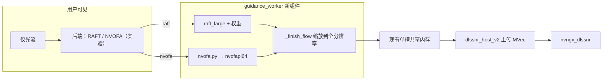

# TODO · 接入 NVOFA 硬件光流

状态：2026-09-10 已完成本地接入。按维护者指定，与深度下线统一归入 v2.1.2 源码提交；下文原先分开提交和下一版本编号的计划已被此安排取代。NVOFA 在默认 `mods/enhancement`，开发只从 `run.bat` 启动。连续画质/默认切换/正式分发待验收。
范围：仅光流路径增加可选硬件光流；默认仍为 RAFT-Large。本文是维护待办，不进入用户发行包。

用户后续确认：NVOFA 以成为主力为目标，真实效率/连续画质通过后可切默认；初始化失败可提示并尝试 RAFT（需权重），运行中失败停止。
此决定覆盖下方原计划的“不回退 RAFT”；CPU 不自动回退仍不变。见 [集成实测](../experiments/NVOFA_INTEGRATION.md)。

2026-09-10 已核对当前代码，实施前先看 [落地检查 N1–N6 / 阶段 B](IMPLEMENTATION_READINESS.md)。
以下保留原计划清单；最新实现与验收状态以集成实测记录为准，不将构建通过当作连续画质放行。

和 [TODO_v2.1.2.md](TODO_v2.1.2.md) 并列、**不要揉进同一次提交**。2.1.2 明确不重编 `guidance_worker.exe`；本项**必须重编组件**。若同一天两件都做：先 2.1.2 界面下线，再做本文。

## 明天开工顺序

1. 无 GPU 的模块、设置、握手、测试先绿，再碰冻结组件。
2. 独立新目录构建 worker，**不要覆盖**正在用的 `mods/enhancement`，直到全片播放过关。
3. 用现有两段原片做连续播放对照，不要只看单帧哈希。
4. 通过前不要改默认后端，不要写「已实时」。

## 勾选清单

按顺序做；未勾的不要标完成。

- [ ] 从 `scripts/nvof_probe.py` 抽出生产模块 `dlss5tool/nvofa.py`（仅 worker 导入；基座应用禁止 import，以免加载 `nvcuda`/`nvofapi64`）
- [ ] 定点数、网格放大、方向、尺寸对齐写成纯函数，无 DLL 的单元测试覆盖
- [ ] 设置键 `guidance_flow_backend`：`raft`（默认）/ `nvofa`；非法值拒绝；CPU＋NVOFA 拒绝
- [ ] `guidance_client.KEYS`、握手、会话重建包含该键；旧组件要 NVOFA 时明确拒绝，**不静默回退 RAFT**
- [ ] NVOFA 不要求、不加载 RAFT 权重；RAFT 档仍要权重
- [ ] `guidance_worker.Models`：NVOFA 走 `OpticalFlow.calculate`；分析尺寸变了重建会话句柄；`close()` 释放
- [ ] 独立光流启用状态替代 `self.flow is not None` 判断；`_flow_input` 分流至 RGB uint8，避免零光流和 RAFT transforms 依赖
- [ ] 能力查询、ABI 尺寸/偏移、对齐后的 fw/fh 一致；CUDA retain/release、半初始化失败、幂等清理、设备身份与系统 DLL 加载测试
- [ ] 握手校验实际 backend/grid/quality/hints；info/错误白名单/metrics 同步；NVOFA 迭代值不触发会话重建
- [ ] 维护者 mode 3 + NVOFA 本轮明确拒绝；mode 0/2 不做光流设备检查；不隐式进入双 Stream
- [ ] 启用检查两帧试推理在 NVOFA 档真正跑硬件光流（第二帧 `reset=False`）
- [ ] 缓存键随 backend 失效（换实例即可）；NVOFA 预测仍是有限 float32，走现有 LRU
- [ ] UI：光流分组增加后端下拉；选 NVOFA 时禁用「迭代次数」，标明实验性；中英词条
- [ ] `tests/test_nvofa.py`（无 GPU）：解码、对齐、设置、握手、缺权重、CPU 拒绝
- [ ] 已有 mode 1 测试默认仍是 RAFT，不要被新键带偏
- [ ] 独立目录 `scripts/build_enhancement.py` 重编 worker；核对 `nvofapi64.dll` **不打进包**
- [ ] spec 与 builder 两次 manifest 生成保持一致；完整 ABI 许可进入独立组件；通过后再更新下一版打包 worker SHA
- [ ] 扩展激活脚本 CLI 可选 backend / mode / 新 mods 目录 / 输出；新增仅光流同参数、真实冻结 worker 的全片 A/B 入口
- [ ] GPU：探针回归 → 激活检查 → 方形/竖屏全片连续播放 vs RAFT（时序，不是逐像素相等）
- [ ] 实验笔记 `docs/experiments/NVOFA_INTEGRATION.md`；`CHANGELOG` / 用户指南只写「可选硬件光流（实验）」
- [ ] 默认仍 RAFT；不把流水线／双缓冲／temporal hints／零拷贝塞进本轮

打包／部署后再勾：

- [ ] 新 `guidance_worker.exe` SHA 写入实验笔记；旧组件备份路径记下
- [ ] 缺 OF 能力的 GPU／驱动：界面失败原因可读，模式保持关闭

## 结论（笔记）

RAFT-Large 是当前仅光流的耗时大头。NVOFA 是 Turing 起 NVIDIA GPU 上的固定功能光流，走驱动自带 `nvofapi64.dll`，不是新权重。独立探针（`scripts/nvof_probe.py`、`docs/experiments/REALTIME_ROUTES.md`）：

| 观察 | 数字（RTX 4070 SUPER，非独占） |
|---|---|
| 合成平移 512×384，SLOW，关 hints | 均值 0.89 ms，P95 1.08 ms；ROI EPE 0.0011 px |
| 竖屏 Small384＋NVOFA 核心 | 约 26.6 fps；同条件 RAFT 约 18 fps |
| 相对 RAFT 的 RGB | 平均差约 0.97/255，最大 51/255 |
| 当前生产 | 仍为 RAFT FP32，6 次更新 |

本轮目标：用户可在「仅光流」里选用 NVOFA，预览／导出／队列走同一条 worker 路径。
**不**把 NVOFA 设为默认，**不**承诺 30 fps，**不**宣称与 RAFT 画质等价。

`raft_final` 的教训：抽帧哈希过了，实拍连续播放会抖。NVOFA 验收以**整段播放**为准。

## 和 2.1.2 / 流水线的关系

| 项 | 2.1.2 | 本项 | 明确不做 |
|---|---|---|---|
| 深度 | 对用户隐藏 | 不碰深度开关 | 不靠深度填满 GPU |
| 光流默认 | RAFT | 仍 RAFT | 不默认 NVOFA |
| `guidance_worker.exe` | 不重编 | **必须重编** | 不覆盖未验收的正在用组件 |
| 引导 ∥ DLSS 双缓冲 | — | — | 仅光流后 `min(引导,DLSS)` 只剩 DLSS 那一截，本轮不做 |

砍掉深度之后，流水线只能藏掉 DLSS 的约 10–40 ms。NVOFA 才是砍 RAFT 数十毫秒的那一刀。双缓冲留到「仍用 RAFT 且 4K DLSS 很长」再考虑。



## 推荐实现

### 放置位置

光流现在在 worker 里算完，经共享内存把全分辨率 float XY 交给宿主。NVOFA 放进 **worker**，宿主 / 共享内存协议不动：

- 基座应用继续 Torch-free、不加载驱动光流 DLL。
- 现有 `_finish_flow`（方向取反、缩放到画布、按分析尺寸换算位移）原样复用。
- 不改 `native/host_v2`。

把探针里的 ctypes ABI 收进 `dlss5tool/nvofa.py`，保留 NVIDIA Optical Flow SDK 头文件的 BSD-3-Clause 声明（探针文件头已有）。本轮不引入 C++ 包装、不往 `third_party/` 拷 SDK。

`OpticalFlow` 只在 `Models.__init__` / `_infer_flow` 里 import。`unittest` 测纯函数，不 `WinDLL`。

### 设置与握手

```python
# app_settings 默认
"guidance_flow_backend": "raft"   # raft | nvofa
```

- `validate()`：只接受这两档；其它值当非法，回落到 `raft` 仅在非 strict 的宽松路径，GUI/队列 strict 则报错。
- `guidance_client.KEYS` 增加 `guidance_flow_backend`，改后端必须重建会话。
- 握手就绪包增加：

  ```text
  flow_backend: "raft" | "nvofa"
  flow_grid: 4 | null          # 仅 nvofa
  flow_temporal_hints: false   # 本轮写死 false
  flow_quality: "slow" | null
  ```

- 旧组件没有 `flow_backend`：仅当请求 `raft` 时视为默认；请求 `nvofa` → `guidance.error.flow_backend_component`（更新完整组件）。
- NVOFA 必须 `device in (auto, cuda)` 且实际 CUDA；CPU → `guidance.error.nvofa_cuda`。不静默改成 RAFT、不静默改 CPU。

`mod_paths.guidance_candidates` / GUI「缺权重」：

- 仅光流 + `nvofa`：**不要** `flow_weights`。
- 仅光流 + `raft`：仍要 RAFT-Large。
- 不要因为选了 NVOFA 就从附加包里删掉 RAFT 权重。

`analysis_parameters`：NVOFA 不把 `guidance_flow_updates` 算进握手期望（硬件没有迭代）。请求里仍可保存 6，避免用户切回 RAFT 丢了次数。

### Worker 行为

`Models.__init__`：

- `nvofa`：不构造 `raft_large`、不 `torch.load` 光流权重；准备 `self._nvof = None`。
- `raft`：现有路径，零改动。

`_infer_flow`（NVOFA）：

1. 输入已是分析尺寸 RGB（`small` / `prev`），与 RAFT 同一套 `analysis_size`。
2. NVOFA 分析宽高采用向上 **16 对齐策略**，并查询实际设备能力；不能把对齐当作硬件支持证明。在生成 `small` 前确定实际 fw/fh，后续缩放使用同一尺寸。RAFT 仍保留 8 对齐。
3. 尺寸变化则 `close()` 旧句柄再 `OpticalFlow(w, h)`。
4. `calculate(first, second)` 按 `guidance_flow_direction` 决定谁是 first/second，与 `prepare_flow` 一致。
5. 返回分析画布上的 float32 HxWx2（已 ÷32、已双线性放到像素网格）。**禁止再乘 grid=4**。
6. `_finish_flow` 照旧：有限值检查、缓存、方向取反、放大到全分辨率、乘 `w/fw`、`h/fh`。

实现约束（与探针一致，便于对照旧数字）：

- API 2.0 CUDA，`nvofapi64.dll` + `nvcuda.dll`，主设备 primary context。
- 灰度输入、4×4 输出、质量档 **SLOW**（Init `perf=5`）。
- `disable_temporal_hints=1`。seek / 切镜 / 缓存命中必须可复现；hints 留到以后仅顺序播放再开。
- 本轮保持同步上传两张图、同步回读。不是 CUDA↔D3D12 零拷贝。

失败：缺 DLL、无 OF 能力、非有限值 → `ModelConfigurationError`，会话作废，GUI 保持关闭并显示原因。

`close()`：释放 NVOF buffer / handle，配对 pop 和 primary context release，与 RAFT 的 stream drain 并列；构造中途失败也要清理，清理失败不遮盖原异常，重复 close 安全。

双 Stream：仅光流本来就是串行；NVOFA 不要去碰 `guidance_execution`。

### 启用检查

`preflight` 128×128 两帧：

- 后端 `nvofa` 时第二帧必须真正 `calculate`，不能只走首帧零光流。
- 128 对齐到 16 仍是 128，探针尺寸覆盖得到。
- 检查失败不启用；不下载、不换后端。

### 缓存

现有 `RawGuidanceCache` 挂在 **Models 实例** 上，实例已绑定权重/精度/方向。加上 backend 后换 NVOFA 会新建实例，不必改 key 元组。

仍禁止：用帧号当键、缓存归一化以后的图、RAFT 与 NVOFA 共用预测。

NVOFA 的低分辨率网格放大后仍按分析画布 float32 存，与 RAFT 输出同角色。

### 界面与文案

「推理模型 → 光流」：

- 现「RAFT-Large」固定标签改成后端下拉：`RAFT-Large` / `硬件光流 NVOFA（实验）`。
- 选 NVOFA：禁用迭代 spin，hint 说明硬件无迭代、结果与 RAFT 不同、需支持 OF 的 NVIDIA GPU 与驱动。
- 分析长边、方向、显示量程仍有效。
- 中英：`guidance.option.raft`、`guidance.option.nvofa`、`guidance.nvofa_hint`、`guidance.error.nvofa_cuda`、`guidance.error.flow_backend_component`、`guidance.error.nvofa`。

2.1.2 若已隐藏深度：本项只动光流分组，不要把深度控件带回来。

CHANGELOG 口径（短句）：

- 新增可选硬件光流（NVOFA，实验）。默认仍为 RAFT。
- 需要支持 Optical Flow 的 NVIDIA GPU 与当前驱动；失败保持关闭，不自动改回 RAFT。
- 运动估计与 RAFT 不同，请用连续画面看遮挡和闪烁，不要只看单帧。

### 许可与打包

- ABI 来自 NVIDIA Optical Flow SDK 公开头文件，BSD-3-Clause；`THIRD_PARTY_NOTICES.md` 增加一节，指向官方仓库 / 编程指南。
- **不要**分发 `nvofapi64.dll` 或替换 DLL；用用户机器上的驱动。
- 冻结组件仍带 Torch（RAFT 备选还在）。NVOFA 不能当成删 CUDA 的理由。
- `enhancement.json` 可加 `"flow_backends": ["raft", "nvofa"]`，旧字段保持兼容。
- `scripts/build_enhancement.py` 输出必须是**新目录**。

## 代码改动（文件级）

| 文件 | 做什么 |
|---|---|
| `dlss5tool/nvofa.py` | **新建**。ctypes API 2.0、S10.5、4×4→像素、会话句柄 |
| `scripts/nvof_probe.py` | 改为薄封装调用 `nvofa.py`，避免两份 ABI |
| `dlss5tool/app_settings.py` | 默认 `raft`；`validate` 选择集 |
| `dlss5tool/guidance_client.py` | KEYS、握手、`validate` 设备规则 |
| `dlss5tool/guidance_parameters.py` | NVOFA 时握手不含 `flow_updates` |
| `dlss5tool/mod_paths.py` | NVOFA 不收集 RAFT 权重 |
| `dlss5tool/guidance_worker.py` | 分支加载 / `_infer_flow` / close |
| `dlss5tool/guidance_settings_ui.py` | 后端下拉；NVOFA 禁用迭代 |
| `dlss5tool/gui.py` | 收集 `guidance_flow_backend`；缺文件列表随后端变 |
| `locales/zh_CN.json`、`en_US.json` | 词条与错误 |
| `tests/test_nvofa.py` | **新建**，无 GPU |
| `packaging/enhancement-contract.json` | 可选声明 `nvofa` |
| `THIRD_PARTY_NOTICES.md` | SDK 声明 |
| `docs/experiments/NVOFA_INTEGRATION.md` | **新建**实测 |

不要改：`native/host_v2`、共享内存单槽、深度公开开关、默认分析长边 512。

## 断言 / 测试

### 无 GPU（CI）

`tests/test_nvofa.py`：

1. `int16` S10.5：`256 → 8.0`、`-128 → -4.0`；网格放大**不**乘 4。
2. 分析 8 对齐 → NVOFA 16 对齐：例如 136→144，128→128。
3. `validate({'guidance_flow_backend':'nvofa'})` 保留；`'nvo'` 在 strict 下失败。
4. `device=cpu` + nvofa → `guidance.error.nvofa_cuda`。
5. 旧就绪包无 `flow_backend` + 请求 nvofa → 组件错误；请求 raft 通过。
6. `guidance_candidates` 在 nvofa 仅光流下不含 `flow_weights`。
7. `analysis_parameters` 在 nvofa 下不含 `guidance_flow_updates`。

现有 activation / cache / parameters 测试默认 backend 仍是 raft。

### GPU（本机，新输出目录）

注意：下方原路线脚本只能复现历史混合深度实验，不是新功能验收。现有激活脚本没有命令行解析，
原计划的 `--source` / `--output` 不生效；实现 N6 的 CLI 和生产 A/B 入口后再写可执行验收命令。
新验收固定 mode 1、相同长边/方向/缓存/宿主，仅改变 backend，显式指向新冻结组件目录。

```powershell
# 1. ABI / 单位仍对
tmp\guidance-cuda-env\Scripts\python.exe scripts\nvof_probe.py --output output\nvofa-probe-new.json

# 2. NVOFA 激活：待扩展 CLI 后补命令，必须显式选新组件、mode 1 和 nvofa

# 3. 历史路线复现（同时改变深度型号/分析尺寸，不可代替生产 A/B）
tmp\guidance-cuda-env\Scripts\python.exe scripts\realtime_routes_probe.py --source "<方形原片>" --output output\nvofa-square-new --variants large512 small384_nvof --full
tmp\guidance-cuda-env\Scripts\python.exe scripts\realtime_routes_probe.py --source "<竖屏原片>" --output output\nvofa-portrait-new --variants large512 small384_nvof --full
```

生产路径接上之后，再加一条**冻结新组件**的仅光流导出（方形 165 帧、竖屏 243 帧）：编码前不要求与 RAFT SHA 相同；必须完整解码、人工看连续播放（遮挡、细小运动、切镜后是否拖影）。切镜 / seek 各至少一次，确认 hints 关闭时不串运动。

缺 OF 的机器：日志和 GUI 说清，模式保持关。

## 明确不做

- 不默认 NVOFA。
- 不静默回退 RAFT / CPU。
- 不打开 temporal hints。
- 不做 CUDA↔D3D12 零拷贝、不做引导∥DLSS 双缓冲。
- 不删 RAFT、不从附加包拿掉 RAFT 权重、不裁 Torch。
- 不把迭代次数映射成 NVOFA 质量档（容易让用户以为 6 次还在）。
- 不以单帧 PNG / 短窗口哈希代替全片播放。
- 不覆盖正在用的 `mods/enhancement`，直到全片过关。
- 不把本项写进 2.1.2 的 CHANGELOG；若 2.1.2 已发布，本项走下一版号（建议 2.1.3）。

## 验收

- 无 GPU：`python -B -m unittest discover -v` 全绿。
- 默认：仅光流仍加载 RAFT，行为与接入前一致（可用现有短序列哈希）。
- 选 NVOFA：不索要 RAFT 权重；试推理两帧通过后才启用；日志 `flow_backend=nvofa`、`flow_updates` 不出现在分析握手里。
- 切回 RAFT：重建会话，重新要权重，缓存不串用。
- 旧组件 + 新 GUI 选 NVOFA：拒绝并提示更新组件。
- 方形、竖屏全片 NVOFA 导出可解码；连续播放无 `raft_final` 那种整段抖动。
- 用户文档写「实验、可选、与 RAFT 不同」；不写实时帧率承诺。
