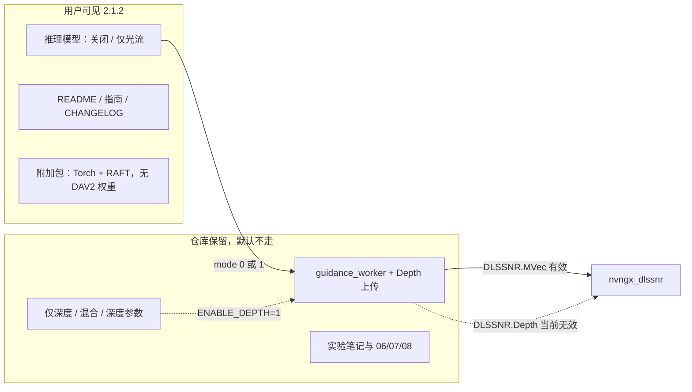

# TODO · v2.1.2 暂时下线深度引导

状态：2026-09-10 按维护者指定，深度下线与 NVOFA 候选统一归入 v2.1.2 源码提交，尚未打包发布。下文保留实施前计划；原先分开提交、不重编 worker 的约束已被本次版本安排取代，完成状态以集成记录为准。
范围：用户界面与发行包隐藏深度选项；仓库保留推理/上传代码。本文是维护待办，不进入用户发行包。

2026-09-10 已核对当前代码，实施前先看 [落地检查 D1–D4 / 阶段 A](IMPLEMENTATION_READINESS.md)。
实现状态见 [集成记录](../experiments/NVOFA_INTEGRATION.md)；发行体积/哈希须实际完整打包后补，不提前标完成。

硬件光流是另一项，见 [TODO_NVOFA.md](TODO_NVOFA.md)。2.1.2 **不重编** `guidance_worker.exe`，不要把 NVOFA 揉进本次提交。

## 勾选清单

按顺序做；未勾的不要标完成。

- [ ] 新增 `dlss5tool/guidance_public.py`：动态读取 env 的 `depth_enabled()`；返回副本的 `normalize_public_settings()`；`public_mode(2)→0`、`public_mode(3)→1`
- [ ] 宿主创建/更新、会话 contract / preflight / 发包、旧队列执行和直接导出统一有效设置，不能仅改 validate 局部 mode
- [ ] 旧 `guidance_preview_view=depth` 折为 flow；组件详情/路径编辑器默认不显示缺深度权重；深度直调导出明确拒绝
- [ ] `app_settings.validate()` / `guidance_client.validate()` / GUI 收集模式走 `public_mode()`；对比目标 `depth` 改为 `flow`
- [ ] 新增 `tests/test_guidance_public.py`（无 GPU）：折算、env 复开、打包不含 DAV2 权重、默认 UI 无深度模式
- [ ] 界面隐藏：模式只留关闭/仅光流；不展示深度分组、色板、加速、双 Stream；预览/导出去掉深度图
- [ ] 中英文案改成光流表述；深度词条保留给 env 复开
- [ ] 已有 mode 2/3 测试在 `setUp` 设 `DLSS5TOOL_ENABLE_DEPTH=1`，不要删内部管道测试
- [ ] `scripts/package_editions.py`：`MODELS` 只留 RAFT-Large；不再强制 DAV2 Large 许可；附加包说明改为光流包
- [ ] 修复打包读取发行说明的路径为 `docs/release/`；最终 full/addon inventory 递归无 DAV2 checkpoint（包括输入 component 自带权重）
- [ ] `verify_editions.py` / `guidance_activation_probe.py` 默认改公开模式验收，完整深度回归独立 opt-in
- [ ] 锁定旧发行完整组件目录而非当前 `mods/enhancement`；具体路径/哈希见落地检查，禁止混用 `_internal`
- [ ] `mods/README.md`：用户步骤只写光流；深度标明本发行不附权重
- [ ] 版本号 `2.1.2`：`app_version.py`、`packaging/DLSS5Tool.version.txt`、README 徽章
- [ ] `CHANGELOG.md` 新增 v2.1.2（不改写 2.1.1 / 2.2.0）；新增 `docs/release/RELEASE_NOTES_v2.1.2.md`
- [ ] 用户文档去掉深度对比与深度选项：`README.md` / `README.en.md`、`docs/USER_GUIDE.md` / `.en.md`、发行包内 `GUIDANCE_PARAMETERS.md`
- [ ] 不要把 `img/06.png`、`07.jpg`、`08.jpg` 和 `scripts/render_depth_showcase.py` 链进用户文档或画廊
- [ ] 内部笔记 `docs/experiments/DEPTH_REFERENCE_STATUS.md`；`docs/README.md`、`PACKAGING_INDEX.md` 加维护索引
- [ ] `python -B -m unittest discover -v` 全绿；手工确认默认 UI 无深度、旧 mode 3 按仅光流、env 仍能开深度

打包打完后再勾：

- [ ] `PACKAGING_INDEX.md` 追加 v2.1.2 体积/哈希（附加包清单无 `depth_anything_v2_vitl.pth`）

## 结论（笔记）

当前版本里，**Depth Anything 能产出可用的相对深度图**，但在**已测运行库、宿主与素材下，深度参考未改变 DLSS 5 增强输出**。开启仅深度或深度＋光流时，增强像素与关闭深度（或仅光流）一致；用户仍要承担模型加载、显存、耗时，以及完整包里约 1.25 GiB 的 Large 权重。

依据：

- `docs/guidance/GUIDANCE_EXPERIMENT.md`（2026-09-08）：合成深度 vs 零深度、深度＋精确光流 vs 仅光流，两种宿主均为逐像素相同。
- 本机后续实机：单张图片开/关深度后增强结果无可见差异；`img/07.jpg` 与 `img/08.jpg` 即同一素材关/开深度的 DLSS 输出，观感一致。
- 原生路径确实会把缓冲设给 `DLSSNR.Depth`（`native/host_v2/dlssnr_host_v2.cpp`），不是 GUI 没算、也不是没上传。测试未观察到该输入改变输出；不能仅由输出相同证明专有运行库内部完全没有读取它。
- **光流仍然有效**（同实验中精确光流 / RAFT 使时序残差约减半）。2.1.2 只下线深度，不停光流。

2.1.2 目标：用户界面与发行包不再提供深度选项；仓库内保留完整推理/上传代码，便于以后运行库一旦消费深度再打开。

## 对外边界

| 给用户看 | 不给用户看 |
| --- | --- |
| 版本号 2.1.2、更新日志里一句话说明「深度暂时下线」 | 实验报告、逐帧哈希、对比图 06/07/08 |
| 可选**光流**、轻量 / 完整 / 附加包（附加包不再含深度权重） | `scripts/render_depth_showcase.py`、深度开/关对照图 |
| 普通增强、超分、对比、导出 | 「仅深度」「深度＋光流」、深度模型/加速/百分位控件 |
| README 实机截图 03、原图/增强 01/02；可选保留光流示意 05 | README 深度对比表、`img/04.png` 深度可视化、非正式备注 |

不删除 `dlss5tool` 里的深度推理、原生上传、组件协议中的 `depth_anything_v2`。不重打未验证的 `guidance_worker.exe`。

## 推荐实现：公开开关 + 运行时折算

新增 `dlss5tool/guidance_public.py`（Torch-free，设置/GUI/打包/测试共用）：

```python
def depth_enabled():
    return os.environ.get('DLSS5TOOL_ENABLE_DEPTH') == '1'

def public_mode(mode: int) -> int:
    # flag 关闭时：2→0（仅深度作废），3→1（混合改仅光流，避免白跑 DAV2）
```

- 默认关闭。维护者测深度管道时设 `DLSS5TOOL_ENABLE_DEPTH=1`，不必改代码。
- `app_settings.validate()` 对 `guidance_mode` 做 `public_mode()`；另外必须在宿主/会话入口折算实际 settings。当前队列并不自动经过设置校验，不能假设已覆盖。旧 mode 2/3 的发包、文件发现与握手必须一致。
- GUI 只在构建时决定可见性；改变 env 后重启。测试 patch env 后须 cleanup，不能依赖导入时常量配合 setUp。
- 深度相关字段（encoder / edge / profile / 百分位）仍读写，方便以后打开；本版界面不展示。
- `startup_settings()` 继续每次 GUI 启动把模式置 0。

不要把开关做到原生 DLL 或冻结组件里：那些本轮不重编。



## 代码改动

### 1. 设置与校验

- `dlss5tool/app_settings.py`：`validate()` 使用 `public_mode()`；`guidance_compare_target` 在开关关闭时若为 `depth` 则改为 `flow`。
- `dlss5tool/guidance_client.py`：`validate()` 的合法 mode 随开关变化；默认路径不再因 mode 2/3 去要深度权重。
- `dlss5tool/gui.py` 收集模式时只认公开列表（0/1，或 flag 打开时 0–3）。

### 2. 界面（`guidance_settings_ui.py`、预览、导出）

开关关闭时：

- 分析模式组合框只保留「关闭 / 仅光流」。
- 不 `pack` 深度分组：型号、深度长边、范围稳定度、百分位。
- 显示分组只留光流量程；藏深度色板/反相。
- 「设置 → 性能与设备」藏深度加速（SDPA＋FP16）；双 Stream 在仅光流下本就串行，一并藏，避免空控件。
- 推理页预览选项去掉「深度图」；对比目标默认光流。
- `guidance_export_ui.py` 导出目标只留光流。
- 中英文案：`guidance.title` / `page_hint` / `adjust_hint` 改成光流表述，不提深度。深度词条保留，供 flag 打开时用。

### 3. 打包与体积

现况（`docs/release/PACKAGING_INDEX.md` E-02/E-03）：

| 组成 | 解压约 | 2.1.2 |
| --- | ---: | --- |
| 轻量版 | 445 MiB | 不变（本就不含模型） |
| Torch 增强组件 | 4.43 GiB | **仍要**（RAFT 还在） |
| RAFT-Large | 20 MiB | 仍打包 |
| DAV2-Large | **1.25 GiB** | **移出发行包** |

附加包大约少 1.25 GiB 解压、压缩后少约 1 GiB，并去掉 CC-BY-NC-4.0 深度权重，公开分发少一块许可负担。GitHub 2 GiB 限制下完整包/附加包仍可能分卷，不要承诺变成单文件。

`scripts/package_editions.py`：

- `MODELS` 只留 `raft_large_C_T_SKHT_V2-ff5fadd5.pth`。
- 不再强制 `DepthAnythingV2-Large-CC-BY-NC-4.0.txt`。
- `ADDON-INSTALL.txt`、`MODEL-NOTICES.md`、`DISTRIBUTION-REVIEW.txt` 改为光流附加包表述。
- **不重编** `guidance_worker.exe`（现 SHA `ae3d2934…` 已验证）。组件里仍可带 DAV2 架构代码，体积可忽略；缺权重时用户侧本来就不会启用深度。

`mods/README.md`：用户步骤只写光流；深度作为「源码/维护者，本发行不附权重」。

### 4. 版本号

单一来源 `dlss5tool/app_version.py` → `2.1.2`，并改：

- `packaging/DLSS5Tool.version.txt`（`filevers` / `FileVersion` / `ProductVersion`）
- README 徽章与截图说明
- `docs/USER_GUIDE.md` / `USER_GUIDE.en.md` 文内版本
- `CHANGELOG.md` 新增 v2.1.2 节；**不改写** v2.1.1 / v2.2.0
- 新增 `docs/release/RELEASE_NOTES_v2.1.2.md`（短、用户口吻）
- `docs/README.md` 索引补上该发行说明

`tests/test_release_packaging.py` 已断言 version 资源与 `__version__` 一致，改完会一起绿。

### 5. 用户文档（隐藏深度）

- `README.md` / `README.en.md`：删「深度 / 光流反推对比」整表和 `img/04`；功能列表改「可选光流」；下载表「还需要光流模型」；去掉完整包「含非商业深度模型」；去掉 README 里未完成测试口吻（「单图片似乎对深度没参考…」）。可保留 `img/05` 作为光流示意，或整段对比都拿掉，避免和深度绑在一起。
- `docs/USER_GUIDE.md` / `.en.md`：章节改为可选光流；启用步骤只留关闭/仅光流；默认参数表去掉深度行；分析图导出只写光流。
- 发行包会带的 `docs/guidance/GUIDANCE_PARAMETERS.md`：对外只保留光流参数；深度行挪到开发笔记，避免 `_internal` 里还在教用户调深度。
- 本轮**不要**把 `img/06.png`、`07.jpg`、`08.jpg` 链进 README，也**不要**当展示图提交到 `img/` 画廊。证据留在实验笔记（可用哈希），文件继续放 `output/` 或保持未跟踪。

### 6. 内部笔记（给以后的自己，不进发行包）

新增 `docs/experiments/DEPTH_REFERENCE_STATUS.md`：

- 判定：深度图可视化有效；`DLSSNR.Depth` 在当前运行库下不改变增强输出。
- 链接已有 `GUIDANCE_EXPERIMENT.md` 逐像素表，以及 2.1.2 产品决定。
- 写明复开条件：新运行库或新宿主证明深度输入改变输出后，再把 `PUBLIC_DEPTH_GUIDANCE` 打开、把 DAV2 权重加回附加包。
- `docs/README.md`、`PACKAGING_INDEX.md` 各加一条维护索引（注明不是用户文档）。

`scripts/render_depth_showcase.py` 留在 `scripts/`（发行隔离本来就会排除）。

## 断言 / 测试

新增 `tests/test_guidance_public.py`（无 GPU）：

1. 默认 `public_mode(2)==0`、`public_mode(3)==1`、`public_mode(1)==1`。
2. `app_settings.validate({'guidance_mode': 3})['guidance_mode'] == 1`。
3. 环境变量 `DLSS5TOOL_ENABLE_DEPTH=1` 时 mode 2/3 保持不变。
4. `package_editions.MODELS` 不含 `depth_anything_v2_*.pth`。
5. GUI（现有 Tk fixture）：模式组合框只有 0/1；深度分组未映射；导出目标不含深度。设 env 后 2/3 和深度控件回来。

已有深度管道测试（activation / cache / execution / host / GUI tab）**不要删**。在会走到 mode 2/3 的用例 `setUp` 里设置 `DLSS5TOOL_ENABLE_DEPTH=1`，避免默认折算把内部回归测没了。只测用户面的用例不设 env。

`tests/test_release_packaging.py`：version 资源；必要时断言基础包 spec 仍 exclude `depth_anything_v2`。

本轮**不**把「开/关深度输出哈希相同」做成 CI：那是 GPU + 专有 DLL，已有实验记录即可。

## 用户可见文案（CHANGELOG 口径）

v2.1.2 用短句，不写实验细节：

- 暂时下线深度引导：本版已测场景未见深度参考改变增强结果，仍会增加耗时、显存和安装体积；**光流引导仍可用**。
- 完整版 / 附加包改为只带 RAFT-Large，不再附带 Depth Anything V2 Large 权重。
- 从 2.1.1 升级：若曾选「仅深度」会视为关闭；「深度＋光流」会视为仅光流。每次启动仍默认关闭，需再勾选光流。

## 明确不做

- 不删深度推理、加速、原生 `PrepareDepth` / `DLSSNR.Depth`。
- 不重编、不替换已验证的 `guidance_worker.exe`。
- 不裁 Torch / CUDA（光流还依赖它；PKG-003/004 已放弃）。
- 不把整个「推理模型」页拿掉。
- 不把 06/07/08 或 showcase 脚本放进用户 README / 便携包。
- 不把「深度永远无效」写进用户文档；只说本版暂时下线。
- 不接入 NVOFA、不重编推理组件（见 [TODO_NVOFA.md](TODO_NVOFA.md)）。

## 验收

- 无 GPU：`python -B -m unittest discover -v` 全绿。
- 手工：默认界面没有深度模式和深度参数；只能开光流；旧设置 mode 3 实际按仅光流检查 RAFT、不要求 DAV2。
- `DLSS5TOOL_ENABLE_DEPTH=1` 仍能选深度（开发用）。
- 基础包体积与 2.1.1 轻量版同级；附加包清单无 `depth_anything_v2_vitl.pth`。
- GitHub README 无深度对比图、无 showcase 脚本入口。
